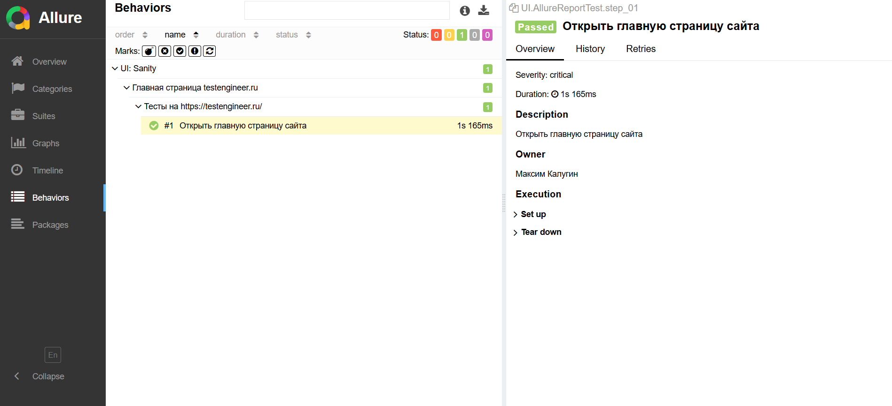

## Allure Report

### Настройка

1) Необходимо добавить зависимости в `pom.xml` согласно инструкции
2) Создать `allure.properties` со значением :
```plaintest
allure.results.directory=target/allure-results
```

3) В тест добавить аннотации:

```java
@Epic("UI: Sanity")
@Feature("Главная страница testengineer.ru")
@Story("Тесты на https://testengineer.ru/")
public class AllureReportTest extends BaseTest {

    @Test(description = "Открыть главную страницу сайта")
    @Description("Открыть главную страницу сайта")
    @Severity(CRITICAL)
    @Owner("Максим Калугин")
    public void step_01(){
        driver.get("https://testengineer.ru/");
        Assert.assertTrue(true);
    }
}
```

4) Запустить тест
5) Выполнить комманду (В папке должен быть `allure-results`):

```bash
   allure serve
```

Пример `Allure Report`:



[Интеграция с TestNG](https://allurereport.org/docs/testng/)