## Docker

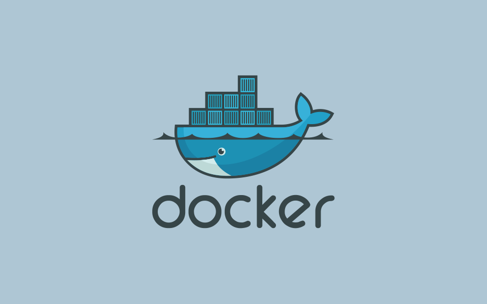

## Dockerfile

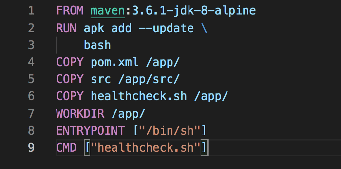

- `FROM` — принять `«maven:3.6.1-jdk-8-alpine»` как начальный образ.
- `RUN` — добавить/обновить (установить) `bash`
- `COPY` — копировать `pom.xml` c локальной машины в папку `/app` внутри `docker-контейнера`
- `COPY src /app/src` — скопировать папку src из локальной машины `/app/src` в Docker-контейнер
- далее `COPY` — копировать файл `healthcheck.sh` из локальной машины в папку `/app` в контейнере.
- `WORKDIR /app/` — создать папку `/app/` в контейнере, которая будет папкой проекта.
- `ENTRYPOINT` — первый запуск команды после запуска контейнера. Настройка оболочки
- `CMD` — запуск описанных выше команд из `shell`-файла после запуска контейнера.

Пример `healthcheck.sh`: это файл оболочки, куда добавляем все команды, нужные для запуска автотестов.

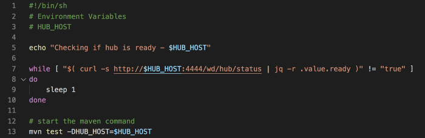

- Команда `echo` здесь — для вывода сообщения о том, что HUB доступен. HUB_HOST это переменная в которую записан `IP`-адрес `Selenium Hub`.
- Проверка статуса этого `Hub’а` — доступен ли
- `mvn` — команда запуска `maven`-проекта с `maven`-тестом и передача параметра с опцией `-D` в виде `IP`-адреса `Selenium`-хаба в код автоматизации.


Интерфейс `Docker Desktop`:

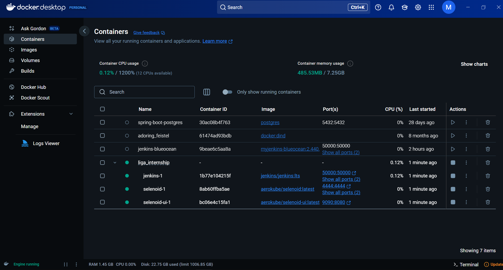

Логи контейнеров:

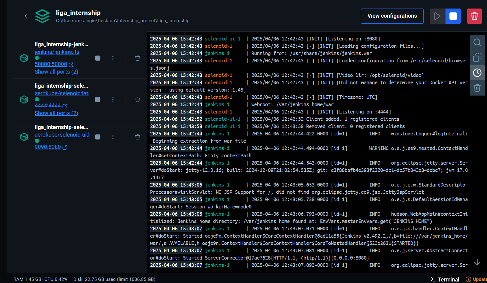

Расширение для просмотра логов :

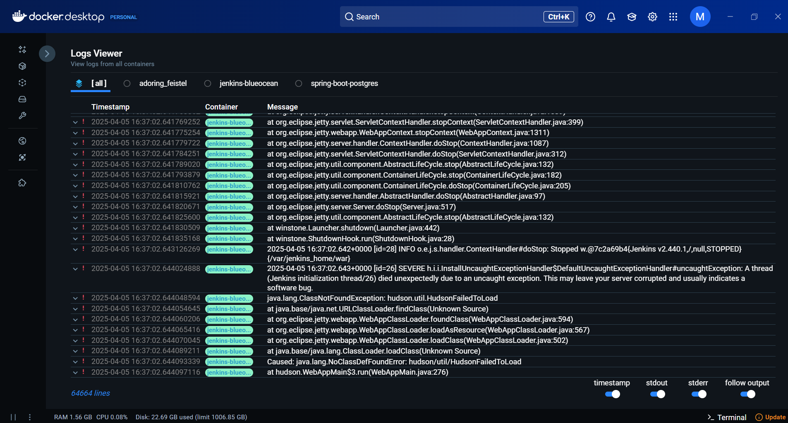

Использование терминала `Docker` (для получения ключа для `Jenkins`):

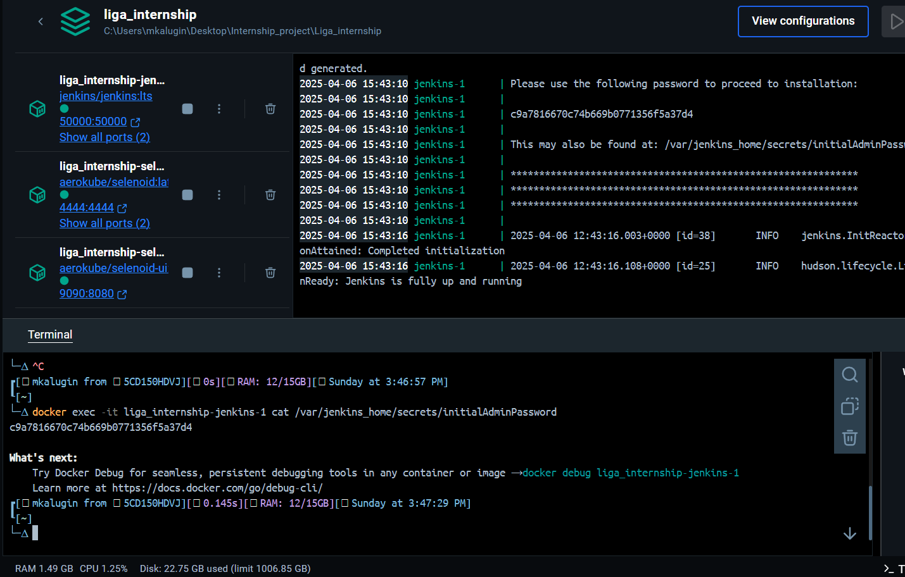

Расширение `Services` для `IDEA`:

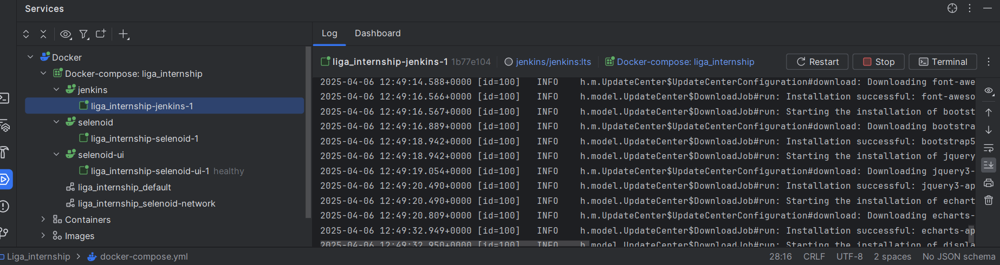

Пример `Dockerfile` для `Jenkins` :

```dockerfile
FROM jenkins/jenkins:2.492.2-jdk17
USER root
RUN apt-get update && apt-get install -y lsb-release
RUN curl -fsSLo /usr/share/keyrings/docker-archive-keyring.asc \
  https://download.docker.com/linux/debian/gpg
  # Chrome instalation 
RUN curl -LO  https://dl.google.com/linux/direct/google-chrome-stable_current_amd64.deb
RUN apt-get install -y ./google-chrome-stable_current_amd64.deb  
RUN rm google-chrome-stable_current_amd64.deb
# Check chrome version
RUN echo "Chrome: " && google-chrome --version

RUN echo "deb [arch=$(dpkg --print-architecture) \
  signed-by=/usr/share/keyrings/docker-archive-keyring.asc] \
  https://download.docker.com/linux/debian \
  $(lsb_release -cs) stable" > /etc/apt/sources.list.d/docker.list
RUN apt-get update && apt-get install -y docker-ce-cli
USER jenkins
RUN jenkins-plugin-cli --plugins "blueocean docker-workflow"
```

Собрать образ:

```bash
   docker build -t myjenkins-blueocean:2.492.2-1 .
```

- `docker`: запуск одной из команд `Docker`
- `build`: билдить образ
- `-t`: присвоить образу тег с названием `2.492.2-1`
- `myjenkins-blueocean`: имя образа
- `.` (точка) : обозначает, что `Dockerfile` расположен в текущей папке

Пример `Dockerize Grid`:

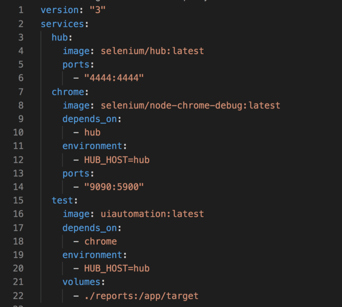

- `hub`: Selenium Hub
- `сhrome`: Chrome Node
- `test`: образ кода автоматизации
- `version`: версия docker-compose
- `services`: управление разными образами
- `image`: имя образа с тегом
- `ports`: номер порта, на котором сервис будет доступен с компьютера (`Host Machine`). Выполняет маппинг портов из `Docker Container` в `Host Machine`
- `depends_on`: показывает зависимости между сервисами. `Depends_on` не ожидает готовности хаба перед запуском теста. Поэтому применяем `curl`-команду в файле `entrypoint.sh` для проверки доступности хаба, перед тем как запустить тест на выполнение.

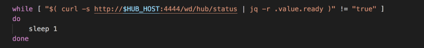

- `environments`: добавляет все нужные переменные окружения. Мы передаем переменную 
`HUB_HOST`, которая содержит `IP`-адрес хаба `Selenium Hub`. 
Посмотрим на код, где применяется эта переменная. 
`Selenium Grid` слушает порт `4444`. Значит нам нужен 
`RemoteWebDriver` для `GRID`.

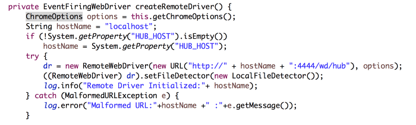

- `volumes`: Для получения отчетов после выполнения тестов.

Образ `Selenoid`:

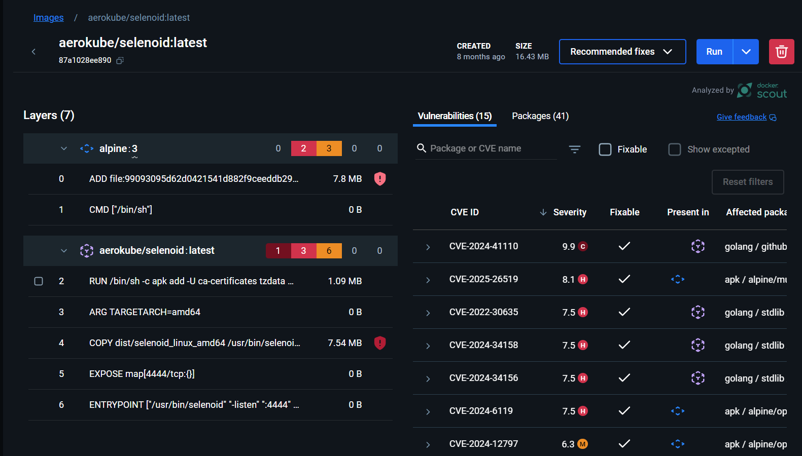

Проверка , что `Selenoid` слушает порт `4444`:

```bash
   docker exec liga_internship-selenoid-1 sh -c "netstat -tuln | grep 4444"
```

Пример вывода в консоль:

```text
tcp       0      0 :::4444                 :::*                    LISTEN
```

