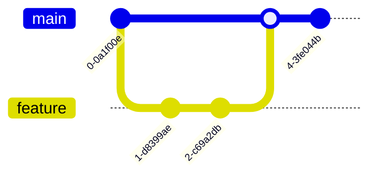
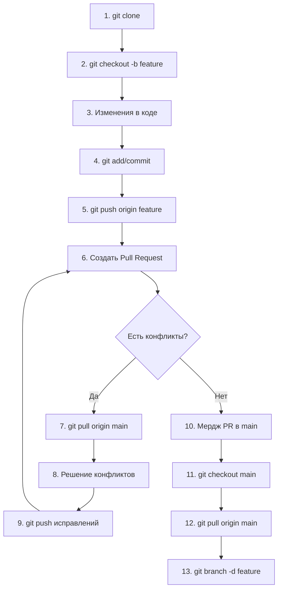
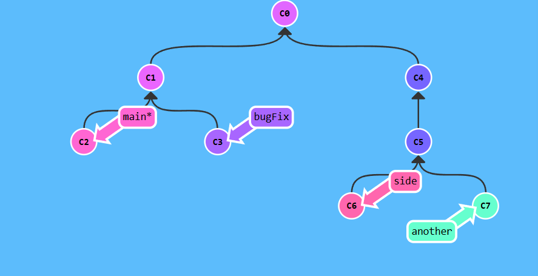
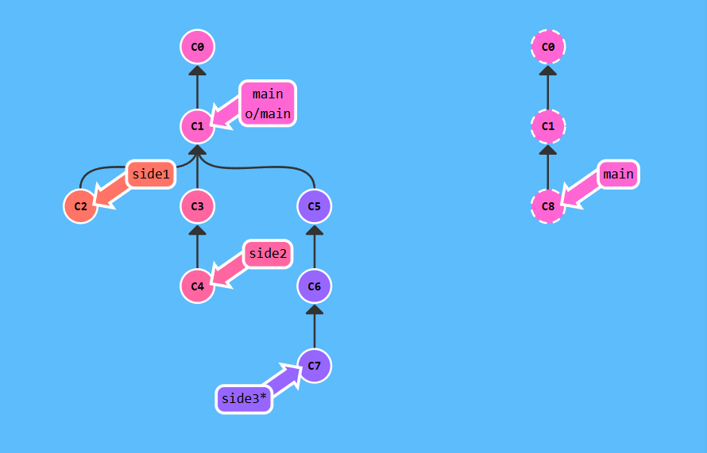
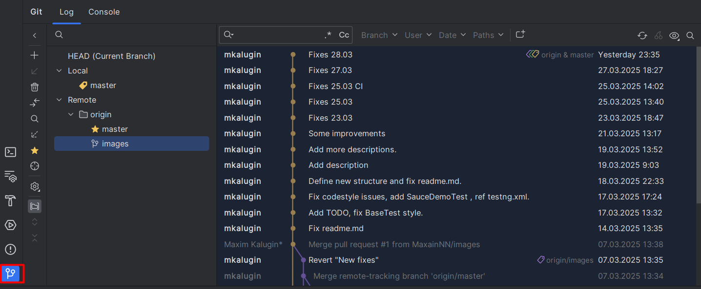
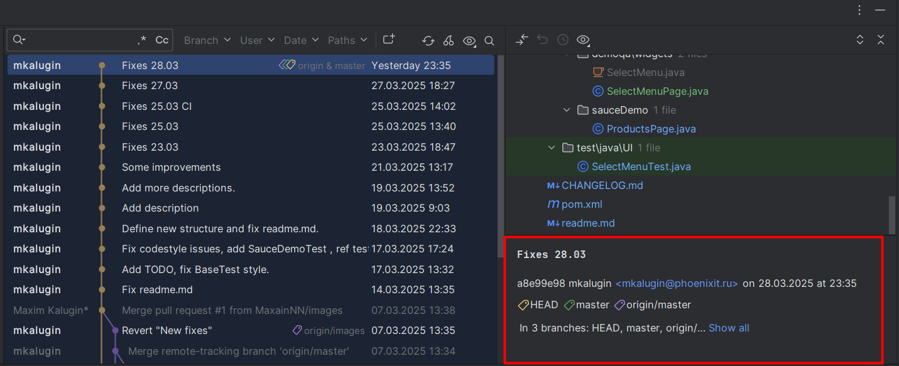
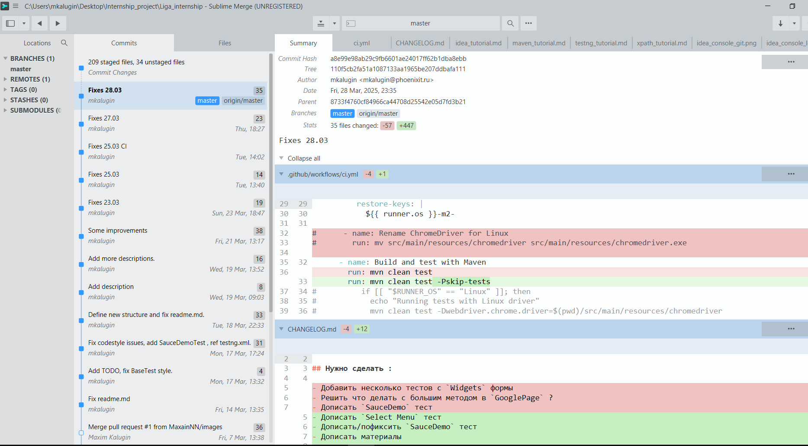
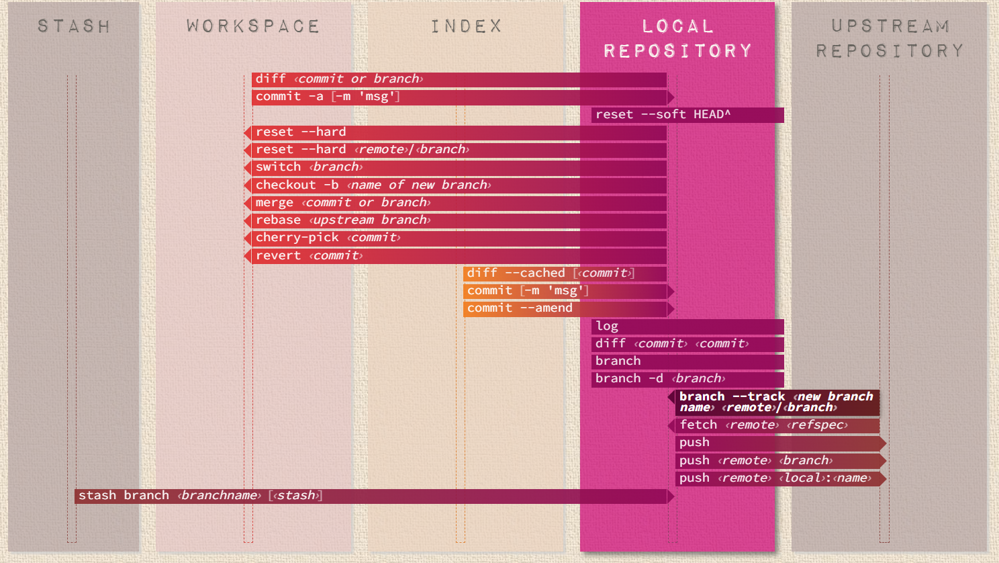

### Система управления версиями Git

### Понятие VSC :

VSC (version control system/система контроля версий) - программное 
обеспечение для облегчения работы с изменяющейся информацией.


### Терминология :
- `branch` (ветвь/ветка) — направление разработки, независимое 
от других. Ветвь представляет собой копию части 
(как правило, одного каталога) хранилища, в которую 
можно вносить свои изменения, не влияющие на другие 
ветви. Документы в разных ветвях имеют одинаковую историю 
до точки ветвления и разные — после неё.
- `commit` (коммит) - сохранение изменений в репозиторий.
Выполняется разработчиком на своем локальном компьютере.
- `push` - Залить новые версии в хранилище.
- `merge` (Слияние) — объединение независимых изменений в единую версию документа. Осуществляется, когда два человека изменили один и тот же файл или при переносе изменений из одной ветки в другую

### Архитектура Git


1) Начало работы:

```plaintext
git clone https://github.com/your-project.git
cd your-project                                
git checkout -b feature/add-button   
```

2) Добавление изменений :

```plaintext
git add src/components/Button.js src/styles/button.css  # Добавляет файлы в staging area
git commit -m "Добавила новую кнопку с анимацией"      # Фиксирует изменения
```

3) Пуш изменений в удаленный репозиторий :

```plaintext
git push origin feature/add-button  # Пушит ветку на сервер
```

4)  Слияние изменений (`merge`)

```plaintext
git checkout feature/add-button  # Переключается обратно на свою ветку
git pull origin main            # Тянет актуальный main (чтобы избежать конфликтов)
```

5) Обновление `main`

```plaintext
git checkout main          # Переключается на main
git pull origin main       # Получает все слитые изменения
```





### Команды Git

```plaintext
# Глобальные настройки
git config --global user.name "Maxim Kalugin"
git config --global user.email mkalugin@phoenixit.ru
git config list # Посмотреть настройки
git config --global credential.helper cache # Кэширование уч. данных

git init # Создать репозиторий
git add # Добавить файлы в index/staging
git status # Проверка статуса репозитория
git diff # Просмотр изменений до коммита
git commit # Создание коммита/внесение изменений
git log # Просмотр истории коммитов
git show <commit_hash> # Просмотр заданного коммита
git rm <dirname/filename> # Удаление отслеживаемых файлов из тек. рабочего дерева
git mv <dirname/filename> <dirname_2> # Переместить файлы в папку
git checkout <filename> # Восстановить файлы тек. дерева, не подготовленные к коммиту
git reset HEAD <filename> # Восстановить подготовленный файл рабочего дерева
git revert HEAD # Откат последнего коммита
git branch <branch_name> # Создание новой ветки и переход в неё
git branch # Просмотр списка веток
git merge <existing_branch_name> # Слияние ветки с основной
git push origin main # Отправка изменений в удаленный репозиторий
git log --graph --oneline --decorate # Отображение журнала фиксации в виде графика для текущей или всех веток
git merge –abort # Прекращение слияния при конфликте
git remote show origin # Получение дополнительных сведений об удалённом репозитории
```

### Как установить Git на Windows

1) Зайти на официальный сайт - https://git-scm.com/
2) Скачать версию для `Windows`
3) Установить
4) Проверить версию - `$ git -v`.
В ответе должно быть (К примеру) : 
`git version 2.45.1.windows.1`


### Ветвение Git

Ветвение - это механизм Git, позволяющий создавать "параллельные вселенные" для вашего кода.
Например у нас есть `master` ветка (основная) , мы создаем
новую ветку - `new_feature`. Когда изменения в новой ветке
готовы вы сливаете его с основной веткой (merge). 
Если эксперимент провалился — просто выбрасываете ветку без вреда для основного кода.

Workflow :

```plaintext
git checkout -b feature/awesome-button  # Создал ветку  
# ... поработал ...  
git add . && git commit -m "Add button"  
git checkout main                      # Вернулся в main  
git merge feature/awesome-button       # Слил изменения  
git branch -d feature/awesome-button   # Удалил ветку
```

Графическое отображение ветвения `Git` :






### Как использовать в Idea

В `Intellij Idea` есть `GUI` (графический интерфейс) для работы с
Git.





Также для комфотной работы рекомендуется использовать 
`Sublime Merge` :



Пример графического отображения `Git flow` :



[Официальная документация по Git](https://git-scm.com/docs)

