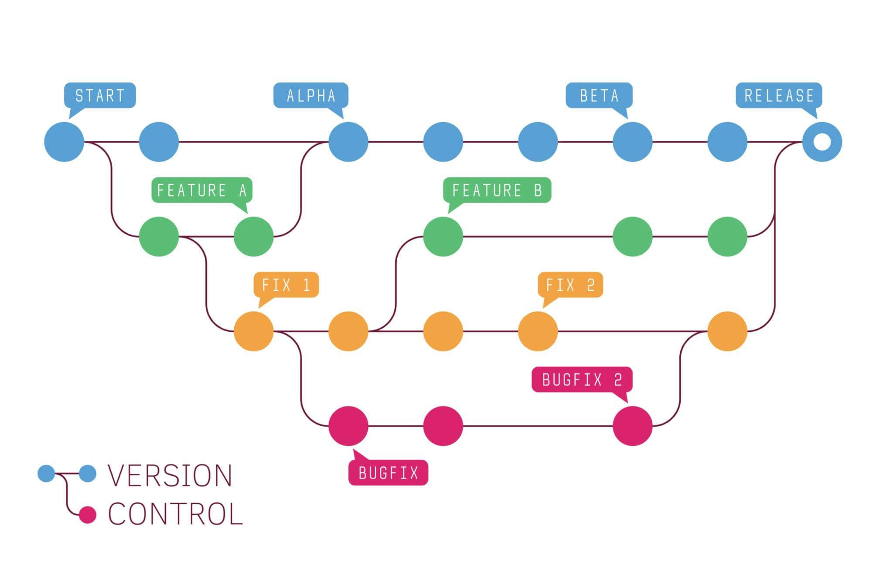

### Система управления версиями Git

### Понятие VSC :

VSC (version control system/система контроля версий) - программное 
обеспечение для облегчения работы с изменяющейся информацией.



### Терминология :
- `branch` (ветвь/ветка) — направление разработки, независимое 
от других. Ветвь представляет собой копию части 
(как правило, одного каталога) хранилища, в которую 
можно вносить свои изменения, не влияющие на другие 
ветви. Документы в разных ветвях имеют одинаковую историю 
до точки ветвления и разные — после неё.
- `commit`
- ``
- ``

### Архитектура Git


### Команды Git

```plaintext
git add
git commit 
git push
```

### Как установить Git на Windows

### Ветвение Git

Ветвение - 

### Как использовать в Idea

В `Intellij Idea` есть `GUI` (графический интерфейс) для работы с
Git.

### GitHub

Links:
https://ru.wikipedia.org/wiki/%D0%A1%D0%B8%D1%81%D1%82%D0%B5%D0%BC%D0%B0_%D1%83%D0%BF%D1%80%D0%B0%D0%B2%D0%BB%D0%B5%D0%BD%D0%B8%D1%8F_%D0%B2%D0%B5%D1%80%D1%81%D0%B8%D1%8F%D0%BC%D0%B8
https://ru.wikipedia.org/wiki/Git
https://learngitbranching.js.org/