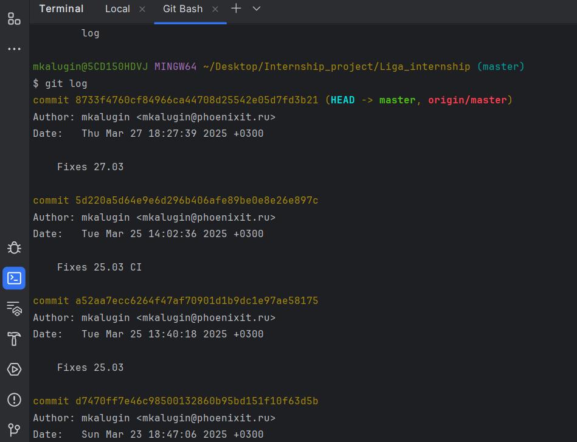
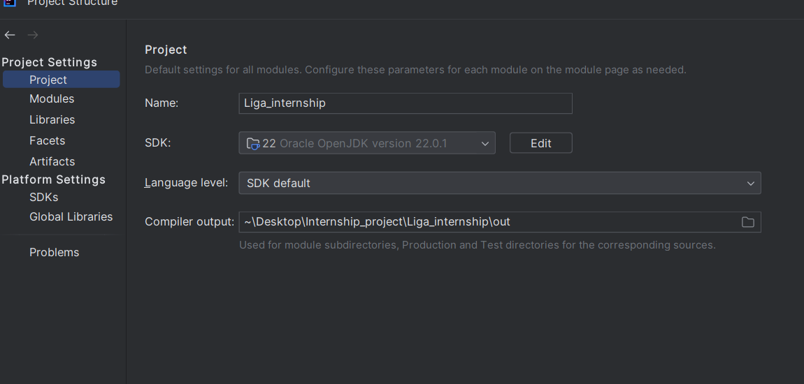

# IDEA

В качестве `IDE` (Integrated development environment)
используется `IntelliJ Idea Community Edition`. Для комфортной работы
рекомендуется ознакомиться с интерфейсом и различными полезными
возможностями.

### Скачивание и установка

- Перейти на сайт - [Официальная страница с IDEA](https://www.jetbrains.com/idea/)
- Нажать `Donwload`
- Пролистать чуть вниз
- Нажать `Download` у `IntelliJ IDEA Community Edition`
- Установить

### Интерфейс среды

- `Главное меню` - расположено в верхней части окна, содержит все основные команды
- `Панель инструментов` - под главным меню, быстрый доступ к часто используемым функциям
- `Навигационная панель` - показывает путь к текущему файлу
- `Проектное окно` - отображает структуру проекта
- `Редактор кода` - центральная часть, где происходит основная работа
- `Панель инструментов редактора` - справа от редактора, содержит кнопки для навигации
- `Панель вкладок` - показывает открытые файлы
- `Статус бар` - внизу окна, отображает информацию о проекте и IDE
- `Боковые панели` (Run, Debug, Terminal и др.) - открываются при необходимости

### Запуск тестов

После установки аннотации `@Test` у метода -
появиться возможность запуска тестовых методов отдельно, 
всех методов в классе.

### Дебаг

#### Установка точек останова (breakpoints):
- Кликните на левое поле редактора рядом с нужной строкой
- Нажмите на значок жука вместо зеленой стрелки (
Убедитесь , что выбран нужный класс)

#### Основные действия при отладке

- `Step Over` - выполнить текущую строку
- `Step Into` - войти в метод
- `Step Out`- выйти из метода
- `Resume Program` - продолжить выполнение до следующей 
точки останова

Пример с `Step Into`:

Переменные в `Threads & Variables`:

Значение в переменной в момент выполнения программы :

### Терминал

Пример вывода в терминал (логи теста):

Можно выбрать `Git bash` терминал :

`Powershell` терминал :

### Настройки

В Настройках можно определить пути до необходимых
зависимостей. (Определить версию `Maven`)

В `Project Structure` можно настроить структуру проекта.

- `Project SDK` – выбор `JDK` (можно добавить 
несколько версий).
- `Project language level` – уровень совместимости 
`Java` (например, 8, 11, 17).
- `Project compiler output` – папка для скомпилированных 
классов (обычно out или target).

