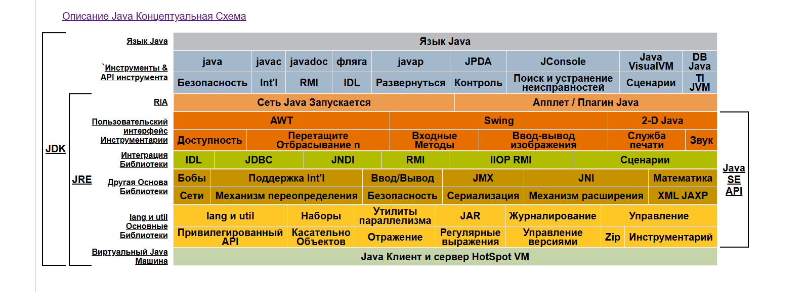
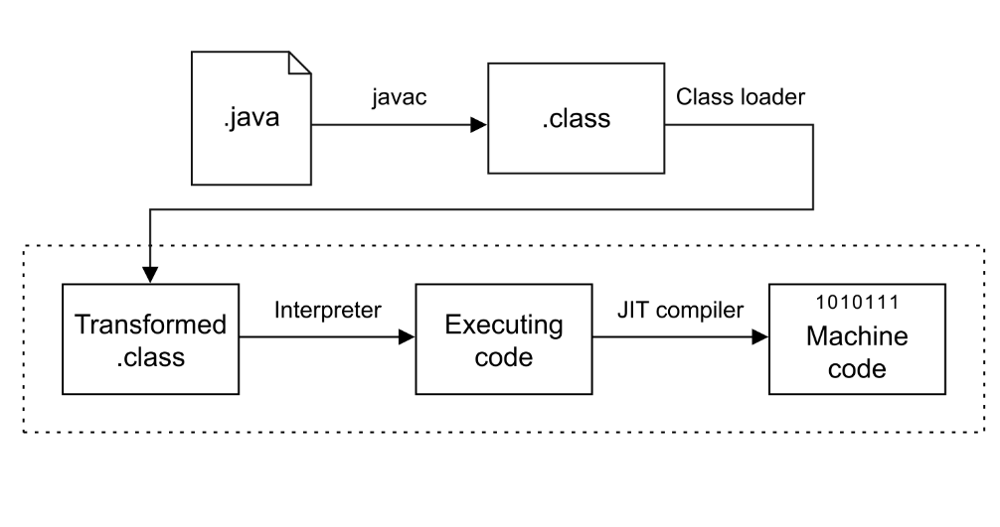
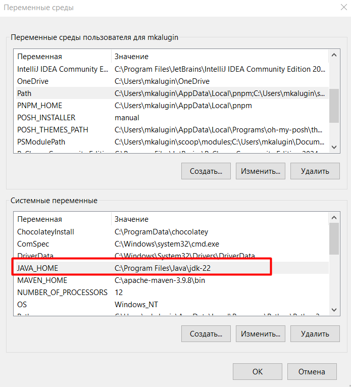
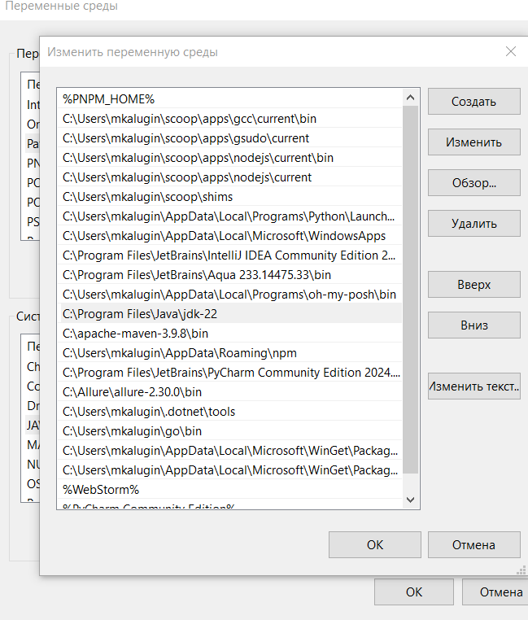

# Java


### Введение

`Java` — это высокоуровневый, объектно-ориентированный язык 
программирования, разработанный компанией `Sun Microsystems `
(позже приобретённой `Oracle`) в 1995 году. Он задумывался как 
универсальный, кроссплатформенный язык с упором на надежность, 
безопасность и простоту разработки.

Одной из ключевых особенностей `Java` является принцип 
"`Write Once, Run Anywhere`" (написано однажды — работает везде),
который обеспечивается за счёт работы на виртуальной машине 
`Java` (`JVM`). Это позволяет запускать скомпилированный 
байт-код на любом устройстве, где установлена `JVM`, 
независимо от операционной системы.

Благодаря строгой типизации, автоматическому 
управлению памятью (сборщик мусора) и богатой 
стандартной библиотеке `Java` остается одним из 
самых популярных языков программирования в мире.

Java программы выполняются (или интерпретируются) другой программой, 
называемой `JVM` (`Java Virtual Machine`). Она не интерпретирует напрямую 
исходный `Java` код, вместо этого `java` код должен быть скомпилирован в 
`.class` файлы (или байт-код), формат которых не является удобным для 
чтения человеком, но это и не машинный код. Технически байт-код — 
это промежуточный язык, или Intermediate language.

### Концептуальная схема Java



Возникает вопрос: что же связывает язык `Java` с `JVM`. И 
ответ на этот вопрос - `.class` файлы, в которые компилируется исходный 
код `Java` (и не только этого языка) и который затем интерпретируется `JVM`.



### Понятия JRE/JDK/JVM

## `JVM` Виртуальная машина Java — исполняющая среда 

Преобразует байт-код (*.class) в машинный код и выполняет его.

Функции:
- Загрузка классов
- Верификация байт-кода
- Управление памятью (Garbage Collection)
- Исполнение кода

```java
public class Main {
    public static void main(String[] args) {
        System.out.println("Hello, JVM!");
    }
}
```

После компиляции (`javac Main.java`) `JVM` 
выполняет `Main.class`.

## `JDK` Полный набор для разработки `Java`-приложений. 

Включает:

- `JRE` (а значит, и `JVM`)
- Компилятор (`javac`)
- Инструменты (`jdb`, `javadoc`, `jstack`)
- Дополнительные библиотеки

Пример компиляции и запуска программы:

```bash
javac Main.java    # Компиляция (создает Main.class)
java Main          # Запуск через JVM
```

## `JRE` Минимальная среда для запуска `Java`-программ. 

Включает:
- `JVM`
- Стандартные библиотеки (например, `java.lang`, `java.util`)

Когда нужно?
Если вы только запускаете `Java`-приложения (но не разрабатываете их).

Пример:
Установка `JRE` для запуска Minecraft:

```bash
java -jar minecraft.jar
```

### Установка на компьютер

После установки также следует добавить пользовательскую переменную 
`JAVA_HOME`, которая будет содержать путь к папке с `Java`, a также
добавить в системную переменную `PATH` к самой `Java`. Они будут 
выглядеть примерно так:

```plaintext
JAVA_HOME = C:\Program Files\Java\jdk-22
PATH = ...;C:\Program Files\Java\jdk-22
```





### Основы языка

Создание прокта в `Idea` и первый `Java` класс

```java
class App {

    public static void main (String args[]) {
        System.out.println ("Hello World!");
    }
}
```

### Переменные, типы данных

В `Java` каждая переменная имеет определённый тип данных, 
который указывает, какие значения она может хранить и какие 
операции с ней можно выполнять. `Java` — это статически 
типизированный язык, поэтому тип переменной определяется 
при её объявлении и не может быть изменён позже.

```plaintext
int age = 25;          // Целое число  
double price = 19.99;  // Число с плавающей точкой  
char grade = 'A';      // Символ  
boolean isActive = true; // Логическое значение  
String name = "Alice";  // Строка  
```

### ООП

Объектно-ориентированное программирование (`ООП`) — это 
способ организации кода в программе путем его группировки в 
виде объектов, то есть отдельных элементов, которые включают 
информацию (значения данных) и функции (действия, которые может 
выполнить объект). Объектно-ориентированный подход к организации 
программы позволяет группировать определенные фрагменты информации 
(например, музыкальную информацию, такую как название альбома, 
название трека или имя исполнителя) вместе с часто используемыми 
функциями или действиями, связанными с этой информацией (например, 
«добавить трек в список воспроизведения» или «воспроизвести все 
песни этого исполнителя»). Эти элементы объединяются в один элемент, 
так называемый объект (например, «Album» или «MusicTrack»). 
Возможность связать вместе эти значения и функции дает несколько 
преимуществ. Например, нужно отслеживать только одну переменную, 
а не несколько; можно сгруппировать вместе связанные между собой 
функции; можно организовать структуру программы так, чтобы она 
больше соответствовала реальным потребностям.

Пример класса:
```java
class App {
    // Аттрибут
    String name = "attribute";

    // Конструктор
    public MyClass(String name) {
        this.name = name;
    }
    // Метод
    public String getName() {
        return name;
    }
}
```

Создание экземпляра класса:

```java
App app = new App("NameForApp");
```

Оператор `new` создает экземпляр указанного 
класса и возвращает ссылку на вновь созданный объект.

### Свойства

Рассмотрим доступ к переменным объектов с 
помощью геттеров и сеттеров. Примером плохого 
написания кода считается, использование для 
переменных класса модификатора доступа `public`.
Это нарушает принцип инкапсуляции. Поэтому для 
защиты был придуман механизм доступа к переменным 
через `get` и `set` (геттер и сеттер) методы, которые 
обычно называют свойства.

`Get` позволяет получить значения (читать значения), 
а `Set` — записать значения в переменную. В коде 
они не отличаются от обычных методов. Но имя метода 
всегда начинается с префикса `get` или `set`.

Объявим все переменные с модификатором доступа 
`private`. Теперь все переменные доступны только 
внутри класса.

Теперь организуем доступ через геттеры и 
сеттеры. Для них мы используем модификатор 
доступа `public`, затем идет тип переменной 
(для каждой свой, такой же, как и у переменных, 
которые мы закрыли), затем имя метода (префикс 
`get/set` и само имя переменной). В фигурных 
скобках пишем `return имя_переменной;` для 
возврата значения переменной (чтения).

```java
class MyClass {
    private String name = "Maxim";
    private int age = 18; // XD

    public String getName() {
        return name;
    }

    public int getAge(){
        return age;
    }

    public void setName(String newName) {
        name = newName;
    }

    public void setAge(int newAge) {
        age = newAge;
    }
}
```
### Ключевое слово "this"

Иногда будет требоваться, чтобы метод 
ссылался на вызвавший его объект. Чтобы это 
было возможно, в `Java` определено ключевое слово 
`this`. Оно может использоваться внутри любого метода 
для ссылки на текущий объект. То есть `this`
всегда служит ссылкой на объект, для которого 
был вызван метод. Ключевое слово `this` можно 
использовать везде, где допускается ссылка на 
объект типа текущего класса.

```java
public class Point {
    public int x = 0;
    public int y = 0;

    // Конструктор
    public Point(int x, int y) {
        this.x = x;
        this.y = y;
    }
}
```

### Конструктор

Конструктор — это специальный метод, который 
вызывается при создании нового объекта. Не всегда 
удобно инициализировать все переменные класса 
при создании его экземпляра. Иногда проще, 
чтобы какие-то значения были бы созданы по 
умолчанию при создании объекта. По сути 
конструктор нужен для автоматической инициализации 
переменных.

Конструктор инициализирует объект непосредственно 
во время создания. Имя конструктора совпадает с 
именем класса, включая регистр, а по синтаксису 
конструктор похож на метод без возвращаемого 
значения.

```java
class Box {
    int width; // ширина 
    int height; // высота 
    int depth; // глубина 

    // Конструктор
    Box() {
        width = 10;
        height = 10;
        depth = 10;
    }
}
```

### Модификаторы "static" и "final"

`final` — это модификатор, позволяющий объявлять 
константные поля в классе. Если у вас есть 
некоторое свойство проектируемого вами объекта, 
значение которого не будет меняться, то вы 
можете воспользоваться этим модификатором. 
Любая попытка переопределить значение поля 
с модификатором `final` приводит к 
выбросу исключения.

`static`: существует на уровне класса, а не 
объекта; Для каждого класса создается 
только один экземпляр статической переменной 
(переменой класса).

При описании статических переменных должны быть 
выполнены следующие правила:

- статические переменные должны быть объявлены 
вне всякого метода;
- статические переменные могут быть 
инициализированы при их объявлении или 
блоком кода, отмеченного ключевым словом 
`static`, и также расположенным вне метода.

### Наследование

Наследование — это один из ключевых принципов 
объектно-ориентированного программирования (ООП), 
позволяющий создавать новый класс на основе существующего 
(родительского). Это обеспечивает переиспользование кода и 
логическую иерархию классов.

- Родительский класс (суперкласс, базовый класс) – класс, свойства и методы которого наследуются.
- Дочерний класс (подкласс, производный класс) – класс, который наследует поля и методы суперкласса.
- Ключевое слово extends – указывает, что класс наследует другой класс.

#### Переопределение методов (@Override)

Дочерний класс может переопределить метод родителя, изменив его логику:

```java
class Animal {  
    void makeSound() {  
        System.out.println("Животное издает звук...");  
    }  
}  

class Cat extends Animal {  
    @Override  
    void makeSound() {  
        System.out.println("Кошка мяукает: Мяу!");  
    }  
}  
```

#### Ключевое слово `super`
`super()` – вызов конструктора родителя (должен быть первой строкой в конструкторе подкласса).

`super.метод()` – вызов переопределённого метода родителя.

```java
class Vehicle {  
    int maxSpeed;  

    Vehicle(int maxSpeed) {  
        this.maxSpeed = maxSpeed;  
    }  
}  

class Car extends Vehicle {  
    String model;  

    Car(int maxSpeed, String model) {  
        super(maxSpeed); // Вызов конструктора Vehicle  
        this.model = model;  
    }  
}
```

#### Абстрактные классы

Абстрактный класс (`abstract`) может содержать абстрактные 
методы (без реализации), которые обязаны быть реализованы 
в подклассах:

```java
abstract class Shape {  
    abstract void draw();  
}  

class Circle extends Shape {  
    @Override  
    void draw() {  
        System.out.println("Рисуем круг...");  
    }  
}  
```

### Интерфейсы

Интерфейс (`interface`) — это абстрактный тип, который определяет 
контракт (набор методов без реализации), который должны 
реализовать классы. В отличие от абстрактных классов, 
интерфейс поддерживает множественное наследование.

#### Зачем нужны интерфейсы?

- Стандартизация – задают обязательные методы для классов.
- Гибкость архитектуры – класс может реализовывать несколько интерфейсов.
- Слабосвязанный код – уменьшает зависимость между компонентами.
- Полиморфизм – работа с разными классами через единый интерфейс.

#### Синтаксис интерфейса

```java
public interface someInterface {
    // Константы (неявно public static final)
    String DEFAULT_URL = "https://example.com";

    // Абстрактные методы (неявно public abstract)
    void click();
    String getText();
}
```

#### Реализация интерфейса в классе

```java
public class LoginPage implements Page {
    @Override
    public void click() {
        System.out.println("Клик по элементу");
    }

    @Override
    public String getText() {
        return "Текст элемента";
    }
}
```

#### Интерфейс для Page Object Model (POM)

Интерфейс для базовых действий страницы:

```java
public interface WebPage {
    void open();
    boolean isLoaded();
    String getPageTitle();
}
```

Реализация в конкретной странице:

```java
public class LoginPage implements WebPage {
    private WebDriver driver;

    public LoginPage(WebDriver driver) {
        this.driver = driver;
    }

    @Override
    public void open() {
        driver.get("https://example.com/login");
    }

    @Override
    public boolean isLoaded() {
        return driver.getTitle().equals("Login Page");
    }

    @Override
    public String getPageTitle() {
        return driver.getTitle();
    }
}
```

Кастомный листенер для логирования (`TestNG`) :

```java
public interface TestListener {
    void onTestStart(ITestResult result);
    void onTestSuccess(ITestResult result);
}

public class CustomTestListener implements TestListener, ITestListener {
    @Override
    public void onTestStart(ITestResult result) {
        System.out.println("Test started: " + result.getName());
    }

    @Override
    public void onTestSuccess(ITestResult result) {
        System.out.println("Test passed: " + result.getName());
    }
}
```

В `testng.xml` указать:

```xml
<listeners>
    <listener class-name="com.example.CustomTestListener"/>
</listeners>
```

### Try-catch

#### **Основная цель `try-catch`**

Обработка исключений, которые могут возникнуть при:
- Ожидании элементов
- Взаимодействии с `DOM`
- Таймаутах
- Проблемах с подключением

---

#### **Какие исключения обрабатываются**

| Исключение | Когда возникает | Опасность |
|------------|----------------|-----------|
| `NoSuchElementException` | Элемент не найден в DOM | Высокая (частый случай) |
| `TimeoutException` | Элемент не появился за заданное время | Средняя |
| `StaleElementReferenceException` | Элемент устарел (DOM обновился) | Средняя |
| `WebDriverException` | Общие проблемы WebDriver | Критическая |

---

#### Без `try-catch`:
```java
public void riskyMethod() {
    if (driver.findElement(By.xpath("...")).isDisplayed()) { // Упадёт здесь
        // Действия
    }
}
```
→ Тест мгновенно завершится с ошибкой

#### С `try-catch`:
```java
public void safeMethod() {
    try {
        if (isElementDisplay("...")) {
            // Действия
        }
    } catch (Exception e) {
        System.out.println("Элемент не найден, но тест продолжается");
    }
}
```
→ Тест:
1. Зафиксирует проблему
2. Выполнит резервный сценарий
3. Продолжит работу или корректно завершится

####  Правильная реализация

```java
public void clickOnButtonOrHandleCaptcha() {
    try {
        WebDriverWait wait = new WebDriverWait(driver, Duration.ofSeconds(5));
        wait.until(driver -> 
            isElementDisplay(RECAPTCHA_TEXT) || 
            isElementDisplay(REPLAY_ANIMATION_BUTTON)
        );
        
        if (isElementDisplay(RECAPTCHA_TEXT)) {
            throw new RuntimeException("CAPTCHA detected");
        } else {
            clickAnimationButton();
        }
        
    } catch (TimeoutException e) {
        // Ничего не найдено - это не ошибка
        System.out.println("Элементы не появились (ожидаемо)");
    } catch (Exception e) {
        // Все другие ошибки
        System.err.println("Критическая ошибка: " + e.getMessage());
        throw e; // Перебрасываем выше
    }
}
```