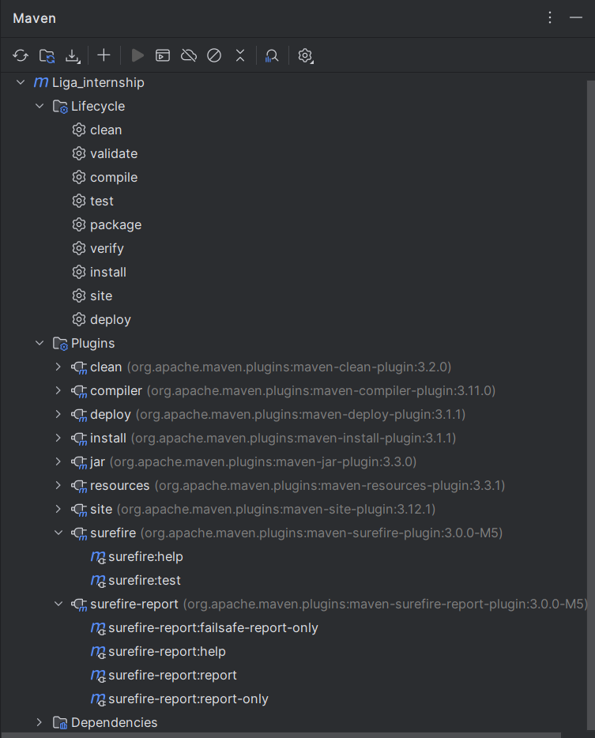
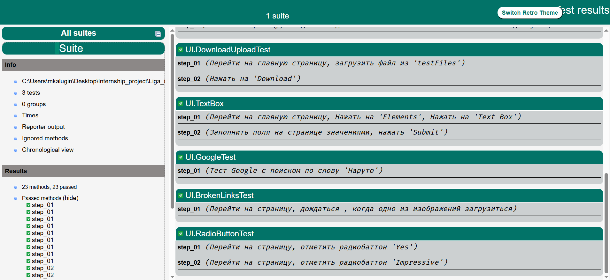
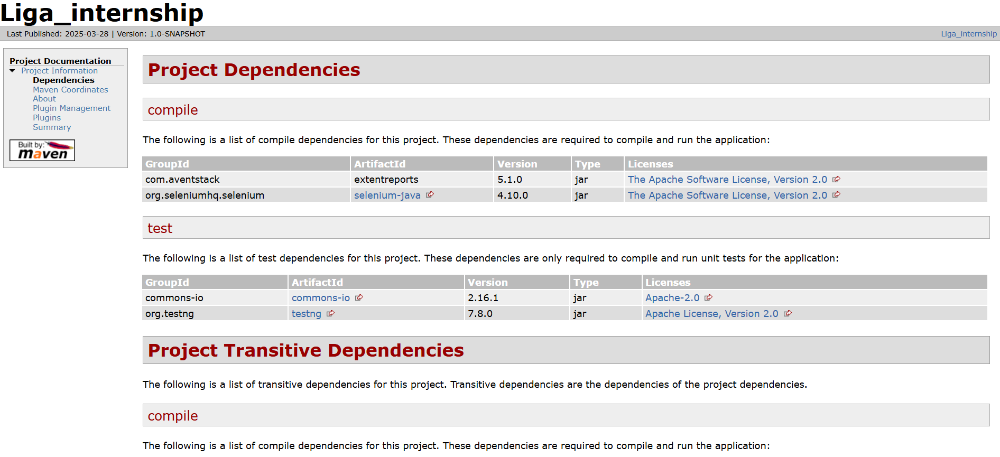
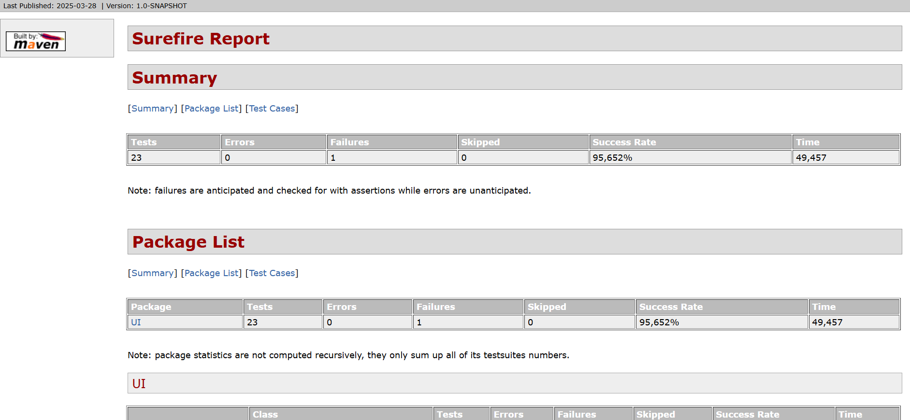
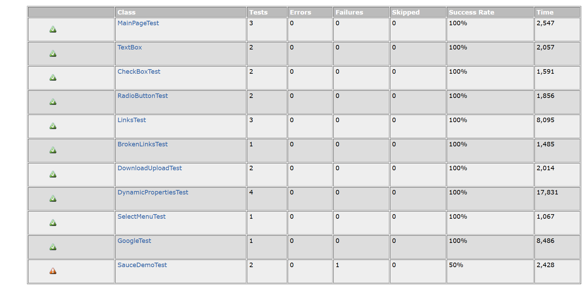
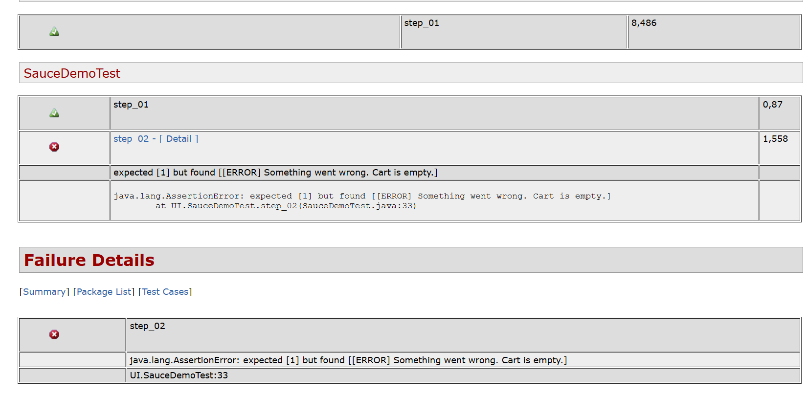

# Maven 

`Apache Maven` — фреймворк для автоматизации сборки 
проектов на основе описания их структуры в файлах 
`POM` (англ. Project Object Model), на языке `XML`. 
(Википедия)


### Структура проекта

```plaintext
 project/
├── pom.xml                ← Главный файл конфигурации Maven
├── src/
│   ├── main/
│   │   ├── java/          ← Исходный код (Java-классы)
│   │   └── resources/     ← Ресурсы (properties, XML, YAML)
│   └── test/
│       ├── java/          ← Тесты (JUnit, TestNG)
│       └── resources/     ← Тестовые ресурсы
└── target/                ← Генерируется Maven (классы, отчеты, JAR/WAR)
```

### Жизненный цикл `Maven` :



|Фаза| Описание                                                         |
|:--:|:-----------------------------------------------------------------|
|validate| 	Проверяет корректность pom.xml                                  |
|compile| 	 Компилирует исходный код (src/main/java → target/classes)      |
|test| 	Запускает тесты (src/test/java → target/test-classes)           |
|package| 	Собирает артефакт (JAR, WAR, EAR) в target/                     |
|verify| 	Проверяет интеграционные тесты                                  |
|install| 	Копирует артефакт в локальный репозиторий (~/.m2/repository)    |
|deploy| 	Загружает артефакт в удаленный репозиторий (Nexus, Artifactory) |


### `Surefire plugin` для `Maven` :

`Surefire Plugin` отвечает за выполнение тестов 
(JUnit, TestNG) во время фазы `test`.

- Ищет тесты по шаблонам:
```plaintext
**/Test*.java
**/*Test.java
**/*Tests.java
**/*TestCase.java
```

- Запускает тесты в фазе `test`.
- Генерирует отчеты в `target/surefire-reports/`.

### Конфигурация в `pom.xml` :

```xml
<build>
    <plugins>
        <plugin>
            <groupId>org.apache.maven.plugins</groupId>
            <artifactId>maven-surefire-plugin</artifactId>
            <version>3.0.0</version>
            <configuration>
                <includes>
                    <include>**/*Test.java</include> <!-- Какие тесты запускать -->
                </includes>
                <excludes>
                    <exclude>**/*IntegrationTest.java</exclude> <!-- Какие тесты пропустить -->
                </excludes>
                <parallel>methods</parallel> <!-- Параллельный запуск -->
                <testFailureIgnore>true</testFailureIgnore> <!-- Продолжать при ошибках -->
            </configuration>
        </plugin>
    </plugins>
</build>
```

После прогона тестов , будет доступен отчет :



### `Site plugin` для `Maven` :

Генерирует `target/site/` с HTML-отчетами :



```bash
   mvn site  
```

### Конфигурация :

```xml
<reporting>
    <plugins>
        <plugin>
            <groupId>org.apache.maven.plugins</groupId>
            <artifactId>maven-surefire-report-plugin</artifactId>
            <version>3.0.0</version>
        </plugin>
    </plugins>
</reporting>
```

Отчет в `target/site/surefire-report.html` 
(Произойдет запуск тестов) :

```bash
   mvn surefire-report:report  
```

Отчет о результатах тестов:







[Документация](https://maven.apache.org/what-is-maven.html)