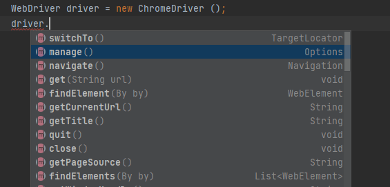

# Selenium


### Иерархия WebDriver


### Примеры взаимодействия с Selenium API  

```java
import org.openqa.selenium.By;
import org.openqa.selenium.JavascriptExecutor;
import org.openqa.selenium.WebDriver;
import org.openqa.selenium.WebElement;
import org.openqa.selenium.chrome.ChromeDriver;
import org.openqa.selenium.interactions.Actions;

import java.time.Duration;

public class Main {
    public static void main(String[] args) {

        // Устанавливаем значение для параметра "webdriver.chrome.driver" = путь до Chrome драйвера
        System.setProperty("webdriver.chrome.driver", System.getProperty("user.dir")+"\\drivers\\chromedriver.exe");
        // Создаем экземпляр Chrome драйвера
        WebDriver driver = new ChromeDriver();
        // Устанавливаем неявное ожидание в 20 секунд
        driver.manage().timeouts().implicitlyWait(Duration.ofSeconds(20));
        // Переходим по ссылке
        driver.get("https://demoqa.com/text-box");
        // Устанавливаем размер экрана = максимальный
        driver.manage().window().maximize();
        // Находим Веб-элемент input с id = userName
        WebElement userNameInput = driver.findElement(By.xpath("//input[@id='userName']"));
        // В элемент (input) вносим значение - "Max"
        userNameInput.sendKeys("Max");
        // Находим все веб-элементы с id = userEmail, в данном случае 1 элемент (input)
        WebElement emailElement = driver.findElement(By.xpath("//*[@id=\"userEmail\"]"));
        // В элемент вносим значение - "BlindFoxKingdom@yandex.com"
        emailElement.sendKeys("BlindFoxKingdom@yandex.com");
        // Находим все веб-элементы с id = currentAddress, в данном случае 1 элемент (input)
        WebElement currentAddressElement = driver.findElement(By.xpath("//*[@id=\"currentAddress\"]"));
        // В элемент вносим значение - "Krukova Street 16 appartment 82"
        currentAddressElement.sendKeys("Krukova Street 16 appartment 82");
        // Находим все веб-элементы с id = permanentAddress, в данном случае 1 элемент (input)
        WebElement permanentAddressElement = driver.findElement(By.xpath("//*[@id=\"permanentAddress\"]"));
        // В элемент вносим значение - "New York"
        permanentAddressElement.sendKeys("New York");
        // Находим все веб-элементы с id = submit, в данном случае 1 элемент (button)
        WebElement button = driver.findElement(By.xpath("//*[@id=\"submit\"]"));
        // Создаем экземпляр JavascriptExecutor
        JavascriptExecutor js = (JavascriptExecutor) driver;
        // Выполняем JavaScript код к элементу button
        js.executeScript("arguments[0].scrollIntoView();",button);
        // Нажимаем на button (кнопку)
        button.click();
        // Находим Веб-элемент p (paragraph) с id = name 
        WebElement userNameOutput = driver.findElement(By.xpath("//p[@id='name']"));
        // Находим Веб-элемент p (paragraph) с id = email
        WebElement userEmailOutput = driver.findElement(By.xpath("//p[@id='email']"));
        // Находим Веб-элемент p (paragraph) с id = currentAddress 
        WebElement userCurAddOutput = driver.findElement(By.xpath("//p[@id='currentAddress']"));
        // Находим Веб-элемент p (paragraph) с id = permanentAddress
        WebElement userPerAddOutput = driver.findElement(By.xpath("//p[@id='permanentAddress']"));
        // Получаем текст из элементов
        String name = userNameOutput.getText();
        String email = userEmailOutput.getText();
        String curAdd = userCurAddOutput.getText();
        String perADd = userPerAddOutput.getText();
        // Выводим значение в консоль
        System.out.println(name + "\n " + email + "\n " + curAdd + "\n " + perADd);
    }
}
```
### Полезные методы

```plaintext
# Нахождение элементов
driver.findElement(By.className("className"));
driver.findElement(By.cssSelector("css"));
driver.findElement(By.id("id"));
driver.findElement(By.linkText("text"));
driver.findElement(By.name("name"));
driver.findElement(By.partialLinkText("pText"));
driver.findElement(By.tagName("input"));
driver.findElement(By.xpath("//\*[@id='idName']"));

# Найти несколько элементов
List<WebElement> anchors = driver.findElements(By.tagName("a"));

# Проверить, видно ли элемент
Assert.assertTrue(driver.findElement(
By.xpath("//div[@class='className']")).isDisplayed());

# Передать файл (upload)
WebElement element = driver.findElement(By.id("Upload1file"));
String filePath = "C:\\WebDriver\\WebDriver.png";
element.sendKeys(filePath);

# Ожидание видимости элемента
WebDriverWait wait = new WebDriverWait(driver, 30);
wait.until(ExpectedConditions.visibilityOfAllElementsLocatedBy(
By.xpath("//[@id='visibleAfterTenSeconds']")));

# Переключение между окнами или вкладками
Set<String> windowHandles = driver.getWindowHandles();
String firstTab = (String)windowHandles.toArray()[1];
String lastTab = (String)windowHandles.toArray()[2];
driver.switchTo().window(lastTab);

# Работа с Alert
Alert alert = driver.switchTo().alert();
alert.accept(); // Принять alert
alert.dismiss(); // Отклонить alert
alert.getText(); // Получить текст из alert
```

### Page Object Model

`Page Object Model` — паттерн проектирования для 
автоматизации тестирования, который улучшает 
поддержку кода, уменьшает дублирование и повышает 
читаемость тестов.

```java
// Пример класса с описанием Page

import org.openqa.selenium.By;
import org.openqa.selenium.WebDriver;
import org.openqa.selenium.WebElement;
import org.openqa.selenium.support.FindBy;
import org.openqa.selenium.support.PageFactory;

public class LoginPage {

    private WebDriver driver;

    public LoginPage(WebDriver driver) {
        this.driver = driver;
    }
    
    private static final String USERNAME_INPUT = "//input[@class='username']";

    private static final String PASSWORD_INPUT = "//input[@class='password']";

    private static final String LOGIN_BUTTON = "//button[@class='button']";
    
    public void enterUsername(String username) {
        sendKeys(By.xpath(USERNAME_INPUT), username);
    }

    public void enterPassword(String password) {
        sendKeys(By.xpath(PASSWORD_INPUT), password);
    }

    public void clickLogin() {
        click(By.xpath(LOGIN_BUTTON));
    }

    public void login(String username, String password) {
        enterUsername(username);
        enterPassword(password);
        clickLogin();
    }
}
```

### Пример структуры Page Object Model
```plaintext
└── src
   ├── main
   │   ├── java
   │   │   ├── browser # Классы конфигурации браузера
   │   │   ├── constant # Классы для переменных
   │   │   ├── pages  # Классы с описанием страниц
   │   │   └── utils # Вспомогательные классы
   │   └── resources # Ресурсы для проекта (Драйверы)
   └── test
       ├── java
       │   ├── base # Базовый класс теста
       │   ├── UI  # Классы для UI тестов
       │   └── utils # Вспомогательные классы для тестов
       └── resources  # Ресурсы для тестов
```

### Вложенные классы в RemoteWebDriver:


#### Конструкторы для создания экземпляров класса:

- `RemoteWebDriver(ICapabilities)`
- `RemoteWebDriver(Uri, ICapabilities)`
- `RemoteWebDriver(ICommandExecutor, ICapabilities)`
- `RemoteWebDriver(Uri, ICapabilities, TimeSpan)`

Пример настройки `WebDriver`:


#### Класс RemoteWebDriver имплементирует такие интерфейсы:

- `WebDriver`
- `JavaScriptExecutor`
- `TakesScreenshot`
- `HasVirtualAuthenticator`
- `PrintsPage`
- `HasCapabilities`
- `Interactive`

### Интерфейс WebDriver

Это «ядро» `WebDriver`, ключевой интерфейс со всеми нужными 
методами; и вложенными интерфейсами. Все эти методы симулируют 
действия пользователя в браузере.


|Метод|Дейсвие|
|:--:|:--:|
|get(String url)|Метод возвращает пустое значение; для перехода по URL в параметре метода|
|getCurrentUrl()|Возвращает текущий URL страницы|
|getTitle()|Тайтл (title) текущей страницы|
|findElements(By by)|Список веб-элементов для локатора, вызываемого By-классом Selenium’а (абстрактный класс)|
|findElement(By by)|Веб-элемент (как выше, но один)|
|getPageSource()|HTML-код последней загруженной страницы в виде DOM|
|close()|Закрывает текущее окно (и закрывает браузер, если это было последнее окно)|
|quit()|Прекращает сессию драйвера, закрывая каждое связанное  ней окно|
|getWindowHandles()|Возвращает список дескрипторов окон (window handles), через них можно получить доступ ко всем открытым окнам этого экземпляра WebDriver|
|getWindowHandle()|Возвращает текущий дескриптор окна (которое сейчас в фокусе) в текущем экземпляре WebDriver, чтобы потом переключиться на это окно.|
|switchTo()|Возвращает TargetLocator для выбора фрейма или окна и отправки ему команд|
|navigate()|Абстракция, позволяющая перейти по URL и по истории браузера|
|manage()|Возвращает интерфейс Options|

Сначала нужно импортировать нужные библиотеки и создать экземпляр `WebDriver`-объекта.



### Selenium Grid

Архитектура `Selenium Grid`:


1) Скачать `Selenium server` с официального сайта.
2) Распаковать на компьюетере. Пример пути - `C:\selenium-server-4.30.0`
3) Открыть терминал в директории с `selenium-server-4.30.0.jar`


4) Выполнить команду :
```bash
   java -jar selenium-server-4.30.0.jar node --hub http://localhost:4444
```

Запутился hub.


5) Открыть еще один терминал и выполнить комманду (Запустить локальный узел (node)) :

```bash
   java -jar selenium-server-4.30.0.jar node --hub http://localhost:4444
```


Отображение hub'а на `localhost:4444`:


6) Указать параметры в классах:

```java

public class SeleniumGridTest{

    boolean useGrid = Boolean.parseBoolean(System.getProperty("use.grid", "false"));

    // hub localhost port - 4444
    // node localhost port - 5555
    String gridUrl = System.getProperty("grid.url", "http://192.168.0.192:4444/wd/hub");
    
    public void setupBrowser(){
        //...
        if (useGrid) {
            try {
                driver = new RemoteWebDriver(new URL(gridUrl), chromeOptions);
            } catch (MalformedURLException e) {
                throw new RuntimeException("Invalid Grid URL: " + gridUrl, e);
            }    
        }
            //...
    }
     
     @Test   
     public void executeTest(){
         System.setProperty("use.grid", "true");
         driver = createDriver();
         driver.get("https://habr.com/ru/hubs/web_testing/articles/page1/");
         System.out.println("[INFO] Page title: " + driver.getTitle());
     }
}

```

`Capabilities` во время выполнения теста:


Результаты теста в `IDEA`:


[Официальная документация](https://www.selenium.dev/documentation/grid/getting_started/)

### Selenoid

Пример архитектуры с использованием `Jenkins`:


Запуск с использованием `Selenoid`:

```bash
   mvn test -Duse.selenoid=true -Dselenoid.url=http://localhost:4444/wd/hub
```

Запуск с использованием `Selenium Grid`:

```bash
   mvn test -Duse.grid=true -Dgrid.url=http://192.168.0.192:4444/wd/hub
```

Для запуска с использованием `Selenoid` :

1) Создать папки на компьютере (или изменить конфигурацию в `docker-compose`):
```plaintext
C:\selenoid\config\
C:\selenoid\video\
C:\jenkins_home\
```

2) Создать файл с конфигурацией браузеров в `C:\selenoid\config\browsers.json`:

```json
{
  "chrome": {
    "default": "latest",
    "versions": {
      "latest": {
        "image": "selenoid/chrome:latest",
        "port": "4444",
        "shmSize": 134217728
      }
    }
  },
  "firefox": {
    "default": "latest",
    "versions": {
      "latest": {
        "image": "selenoid/firefox:latest",
        "port": "4444"
      }
    }
  }
}
```
3) Выполнить команду в корне проекта:

```bash
   docker-compose up -d
```

Будут доступны сервисы:

- `Selenoid UI`: http://localhost:9090
- `Jenkins`: http://localhost:8081
- `Selenoid Hub`: http://localhost:4444/wd/hub

4) Проверить настройки инициализации браузера:

```java

public class Browser {
    
    public void createBrowser(){

        //...
        // Настройки удаленного драйвера
        DesiredCapabilities caps = new DesiredCapabilities();
        caps.setBrowserName("chrome");
        caps.setVersion("latest");
        caps.setCapability("enableVNC", true);
        caps.setCapability("enableVideo", true);

        WebDriver driver = new RemoteWebDriver(
                new URL("http://localhost:4444/wd/hub"),
                caps
        );
        //...
    }
}
```

[Официальная документация](https://aerokube.com/selenoid/latest/)