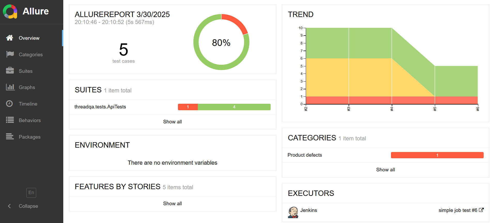
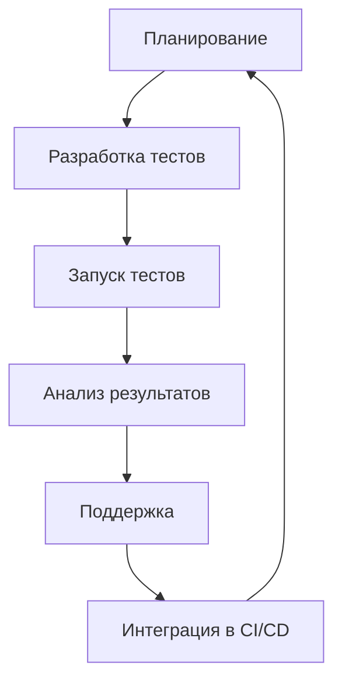

# Общие понятия в тестировании


`Автоматизированное тестирование программного обеспечения` 
(Software Automation Testing) - это процесс верификации 
программного обеспечения, при котором основные
функции и шаги теста, такие как запуск, инициализация, 
выполнение, анализ и выдача
результата, выполняются автоматически при помощи инструментов
для автоматизированного тестирования.

### Пирамида тестирования :

Условно, тестируемое приложение можно разбить на 3 уровня:
- `Unit Tests Layer`
- `Functional Tests Layer (API tests)`
- `GUI Tests Layer (UI tests)`


### Жизненный цикл в автоматизации тестирования:


1) `Планирование` (Test Strategy & Planning)

Цель: Определить, что и как автоматизировать.

Действия:
- ✅ Выбор инструментов (`Selenium`, `Appium` , `JUnit`/`TestNG`)
- ✅ Определение scope (какие тесты автоматизировать, а какие оставить ручными)
- ✅ Оценка трудозатрат (сколько времени займет разработка и поддержка)
- ✅ Создание Test Plan (документ с подходами и целями)

2) `Разработка тестов` (Test Development)

Цель: Создать стабильные и поддерживаемые автотесты.

Действия:
- ✅ Написание тестовых скриптов (`Page Object Model`, `Screenplay Pattern`)
- ✅ Интеграция с фреймворками (`JUnit`, `TestNG`, `pytest`)
- ✅ Настройка отчетов (`Allure`, `ExtentReports`)
- ✅ Добавление логирования (`Slack`-уведомления, логи в `ELK`)

3) `Запуск тестов` (Test Execution)

Цель: Проверить корректность работы системы.

Способы запуска:
- 🔹 Локально (`mvn test`, `pytest`)
- 🔹 В `CI/CD` (`Jenkins`, `GitHub Actions`, `GitLab CI`)
- 🔹 Параллельно (`Selenium Grid`, `BrowserStack`)
- 🔹 По расписанию (ночной прогон регресса)

4) `Анализ результатов` (Test Reporting & Analysis)

Цель: Выявить дефекты и оценить стабильность сборки.

Что анализируем?
- 📊 Статус тестов (Passed/Failed/Skipped)
- 📉 Flaky-тесты (нестабильные тесты)
- 🔍 Логи ошибок (скриншоты, stacktrace)
- 📌 Дефекты (автосоздание багов в `Jira`)

Пример отчета `Allure`:



5) `Поддержка и оптимизация` (Maintenance)

Цель: Уменьшить технический долг.


|Проблема|                 Решение                 |
|:--:|:---------------------------------------:|
|Ломаются селекторы|        Использовать `data-testid`         |
|Медленные тесты| Оптимизировать ожидания (`WebDriverWait`) |
|`Flaky`-тесты|         Добавить `retry`-механизм         |
|Устаревшие зависимости|  Обновить библиотеки (`Selenium`, etc.)   |

Пример решения :

```plaintext
// Было:
Thread.sleep(5000);

// Стало:
wait.until(ExpectedConditions.visibilityOf(element));
```

6) `Интеграция в CI/CD` (Continuous Testing)

Цель: Запускать тесты автоматически при каждом изменении кода.

Разработчик пушит код → `CI`-сервер (`Jenkins`/`GitHub Actions`) 
запускает тесты.

Если тесты падают → сборка не деплоится.

Отчет отправляется в `Jira`.



`Ключевые метрики автоматизации` :

- 📌 `Test Coverage` — % покрытия кода тестами
- 📌 `Pass Rate` — % успешных тестов
- 📌 `Execution Time` — время прогона тестов
- 📌 `Defect Detection Rate` — сколько багов нашли