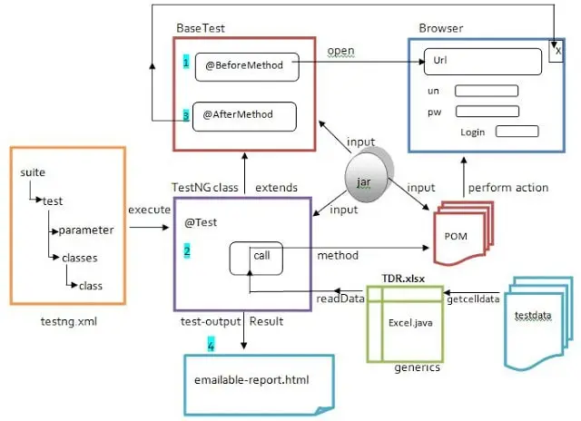
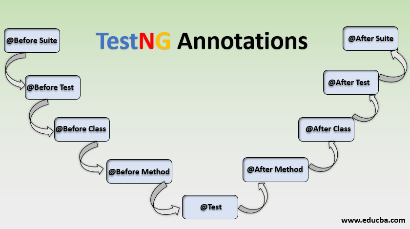
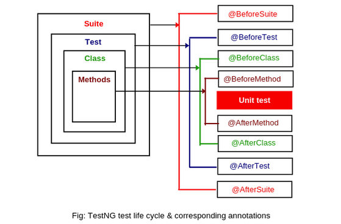

### TestNG


`TestNG` - фрэймворк для для тестирования Java-приложений.

### Архитектура:



### Основные аннотации:

|     Аннотация      |                                 	Описание                                 |
|:------------------:|:-------------------------------------------------------------------------:|
|       @Test	       |                        Помечает метод как тестовый                        |
|    @BeforeSuite    |                 	Запускается перед всеми тестами в Suite                  |
|    @AfterSuite	    |                   Запускается после всех тестов в Suite                   |
|    @BeforeTest	    |           Выполняется перед тестами внутри <test> в testng.xml            |
|    @AfterTest	     |           Выполняется после тестов внутри <test> в testng.xml.            |
|       @BeforeClass |                 	Запускается перед первым методом класса                  |
|    @AfterClass     |                  	Запускается после всех методов класса                   |
|   @BeforeMethod    |            	Выполняется перед каждым тестовым методом (@Test)             |
|    @AfterMethod    |            	Выполняется после каждого тестового метода (@Test)            |
|    @Parameters	    |            Позволяет передавать параметры из testng.xml в тест            |
|   @DataProvider    |          	Возвращает данные для параметризованных тестов                  |
|    @Listeners	     | Подключает кастомные listeners (например, для логирования или скриншотов) |

Порядок выполнения аннотаций:





### Для управления тестов используется `testng.xml`:

```xml
<!DOCTYPE suite SYSTEM "https://testng.org/testng-1.0.dtd">
<suite name="MyTestSuite" verbose="1">

    <listeners>
        <listener class-name="UI.GoogleTest" />
        <listener class-name="UI.MainPageTest" />
    </listeners>

    <test name="DemoQATests" preserve-order="true">
        <parameter name="browser" value="chrome" />
        <classes>
            <class name="UI.DynamicPropertiesTest" />
            <class name="UI.DownloadUploadTest" />
        </classes>
    </test>

    <test name="GoogleTests">
        <classes>
            <class name="UI.GoogleTest" />
        </classes>
    </test>
</suite>
```

|        Тэг         |                 Описание                 |
|:------------------:|:----------------------------------------:|
|       suite        |           контейнер для тестов           |
|        test        |   группа тестов (может быть несколько)   |
| classes / packages | указывает, какие классы/пакеты запускать |
|     parameter      |        передает параметры в тесты        |
|     listeners      |      подключает listeners                |


### Подключение `testng.xml` в `Maven`:

```xml
<build>
    <plugins>
        <plugin>
            <groupId>org.apache.maven.plugins</groupId>
            <artifactId>maven-surefire-plugin</artifactId>
            <version>3.0.0-M7</version>
            <configuration>
                <suiteXmlFiles>
                    <suiteXmlFile>src/test/resources/testng.xml</suiteXmlFile>
                </suiteXmlFiles>
                <properties>
                    <property>
                        <name>listener</name>
                        <value>com.example.MyTestListener,com.example.MyReportListener</value>
                    </property>
                </properties>
            </configuration>
        </plugin>
    </plugins>
</build>

```

Указать можно в 
`<suiteXmlFiles><suiteXmlFile>{путь_до_testng.xml}</suiteXmlFile></suiteXmlFiles>`
или в 
`<property><name>listener</name><value>{название_листенера}</value></property>`

### Пример теста с параметрами и `DataProvider` :

```java
import org.testng.annotations.*;

public class ExampleTest {
    // Тест , имеет group = smoke и приоритет = 1
    @Test(priority = 1, groups = "smoke")
    public void testLogin() {
        System.out.println("Smoke test");
    }

    // Тест с данными
    @Test(dataProvider = "users")
    public void testUsers(String username, String password) {
        System.out.println("User: " + username + ", Pass: " + password);
    }

    // Данные
    @DataProvider(name = "users")
    public Object[][] userData() {
        return new Object[][] {
            {"user1", "pass1"},
            {"user2", "pass2"}
        };
    }

    // Тест с параметрами из testng.xml
    @Parameters({"browser"})
    @Test
    public void testBrowser(String browser) {
        System.out.println("Browser: " + browser);
    }
}
```

### Параметризированные тесты

Параметризация предназначена для запуска теста с 
разными данными (параметрами). Например, создается отдельный 
метод для приема данных из другого файла. Тестовый метод 
становится реюзабельным, может запускаться с разными 
подборками данных. Применяются аннотации `@Parameter `
и/или `@DataProvider`. Аннотируем метод при помощи `@Parameter`:

```java
@Test
@Parameters({"value", "isEven"})
public void givenNumberFromXML_ifEvenCheckOK_thenCorrect(int value, boolean isEven) {
    assertEquals(isEven, value % 2 == 0);
}
```

И передаем данные через `XML`:

```xml
<suite name="My test suite">
    <test name="numbersXML">
        <parameter name="value" value="1"/>
        <parameter name="isEven" value="false"/>
        <classes>
            <class name="UI.AllureReportTest"/>
        </classes>
    </test>
</suite>
```

Для сложной структуры используется `@DataProvider`:

```java
@DataProvider(name = "numbers")
public static Object[][] evenNumbers() {
    return new Object[][]{{1, false}, {2, true}, {4, true}};
}
 
@Test(dataProvider = "numbers")
public void givenNumberFromDataProvider_ifEvenCheckOK_thenCorrect(Integer number, boolean expected) {    
    assertEquals(expected, number % 2 == 0);
}
```
### Связанные тесты:

Когда первый тест падает, а следующие должны 
выполняться, при этом не отделяясь как «пропущенные». 
Добавляем параметр `dependsOnMethod` в `@Test`:

```java
@Test
public void givenEmail_ifValid_thenTrue() {
    boolean valid = email.contains("@");
    assertEquals(valid, true);
}
 
@Test(dependsOnMethods = {"givenEmail_ifValid_thenTrue"})
public void givenValidEmail_whenLoggedIn_thenTrue() {
    LOGGER.info("Email {} valid >> logging in", email);
}
```

### Параллельный запуск :

Указываем атрибут `parallel` в теге `suite` 
конфигурационного `XML`, значение `classes`:

```xml
<suite name="suite" parallel="classes" thread-count="2">
    <test name="test suite">
        <classes>
        <class name="UI.RadioButtonTest" />
            <class name="UI.SeleniumGridTest" />
        </classes>
    </test>
</suite>
```

Если в `XML`-конфигурации имеется много test-тегов, 
они все будут запущены параллельно, если указано 
`parallel = “tests”`. Чтобы параллельно запустить 
отдельные методы, указываем `parallel = “methods”`

```java
public class MultiThreadedTests {
    
    @Test(threadPoolSize = 5, invocationCount = 10, timeOut = 1000)
    public void givenMethod_whenRunInThreads_thenCorrect() {
        int count = Thread.activeCount();
        assertTrue(count > 1);
    }
}
```

Значение `threadPoolSize` означает, что метод запущен 
в `n` потоках. Значения `invocationCount` и `timeOut` 
означают, что тест будет запущен `invocationCount` раз и 
завершится, когда выйдет время ожидания `timeOut`.


[Официальная документация](https://testng.org/)