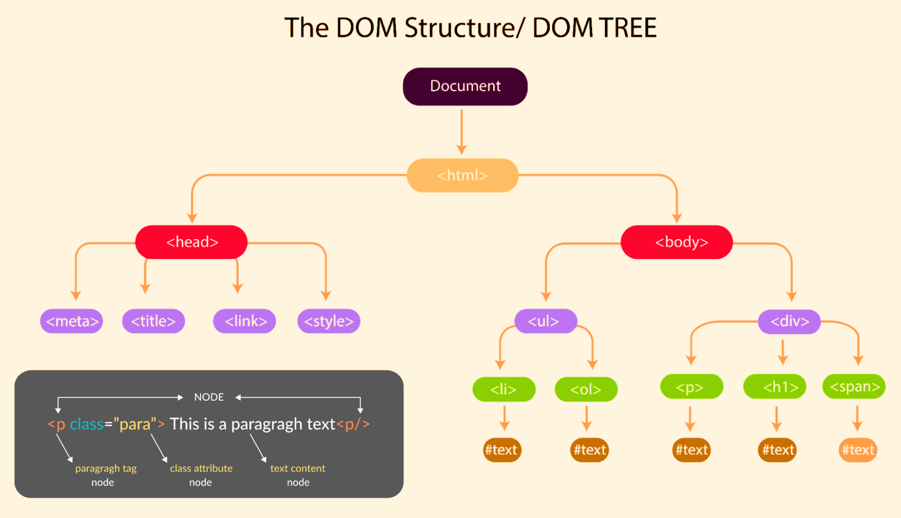
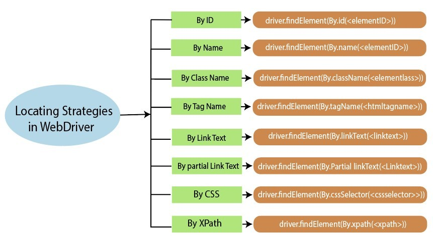
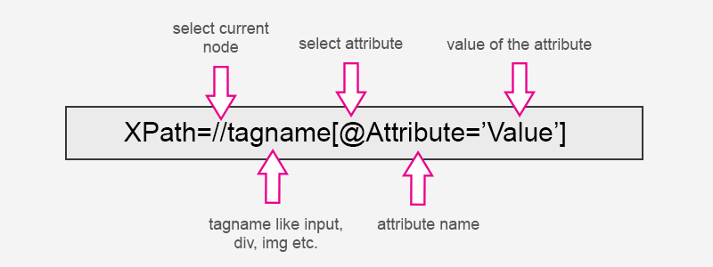

# Xpath


### Введение: 

Xpath - 

### Document Object Model (DOM)



### Виды локаторов



### Почему Xpath

### Структура



### Синтаксис

```plaintext
// - Поиск в любом месте документа.
/ - Поиск от корня или переход на уровень ниже.
[] - указание условий фильтрации элементов.
@ - указывает, что мы работаем с атрибутом элемента.

```

### Примеры использования

Links:
https://habr.com/ru/articles/887964/
https://habr.com/ru/articles/753332/
- https://habr.com/ru/companies/intec_balance/articles/884482/ - статья про использование Devtools