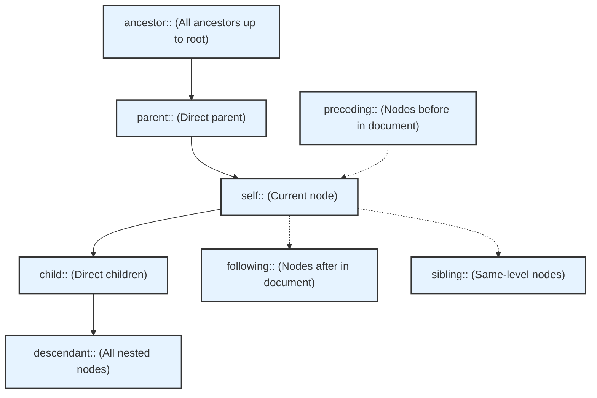

# Xpath


### Введение: 

`Xpath` - это полноценный язык для поиска элементов в 
дереве, причём неважно каком, будь это `XML` или `XHTML`. 
Можно использовать `XPath` в веб-страницах, нативной 
мобильной вёрстке и других инструментах

### Плюсы и Минусы Xpath
#### Плюсы Xpath

- полноценный язык для поиска элементов не только в 
вебе, но и в других средах и документах
- позволяет перемещаться по дереву вниз и вверх
- гибко работает с осями элементов
- есть очень много функций, которые помогают в 
поиске локаторов, например, поиску по тексту в элементе 
или аналог `normalize-space`, который убирает пробелы у 
строки по бокам.

#### Минусы Xpath

- громоздкий
- нечитабельный
- сложен в освоении
- работает дольше, чем поиск по `CSS`, хоть и незначительно

### Document Object Model (DOM)


Объектная модель документа `DOM` (`Document Object Model`) 
— это независящий от платформы и языка программный интерфейс
, позволяющий программам и скриптам получить доступ к 
содержимому `HTML-`, `XHTML-` и `XML-`документов, а также 
изменять содержимое, структуру и оформление таких документов.

Модель `DOM` не накладывает ограничений на структуру 
документа. Любой документ известной структуры с помощью 
`DOM` может быть представлен в виде дерева узлов, каждый 
узел которого представляет собой элемент, атрибут, 
текстовый, графический или любой другой объект. Узлы 
связаны между собой отношениями «родительский-дочерний»

### Виды локаторов

Локатор веб-элемента – это объект, который находит 
и возвращает веб-элементы на странице по заданному запросу.


Есть очень много видов локаторов, но чаще всего 
в работе применяется лишь часть из них:
- `ID`
- `name`
- `class name`
- `tag name`
- `link text`
- `partial link text`
- `css selector`
- `xpath`

### Почему Xpath

`XPath` включает более 200 встроенных функций.
Есть функции для работы со строковыми, числовыми и 
логическими значениями, функции для сравнения даты 
и времени, для манипуляции узлами и 
последовательностями и многое другое.

### Структура


### Синтаксис

```plaintext
// - Поиск в любом месте документа.
/ - Поиск от корня или переход на уровень ниже.
[] - указание условий фильтрации элементов.
@ - указывает, что мы работаем с атрибутом элемента.
.. - выбирает родителя текущего узла
```

#### Оси :

```plaintext
ancestor - Выбирает всех предков (родителей, прародителей и т.д.) текущего узла
ancestor-or-self - Выбирает всех предков (родителей, прародителей и т.д.) текущего узла и сам текущий узел
attribute - Выбирает все атрибуты текущего узла
child - Выбирает всех потомков текущего узла
descendant - Выбирает всех потомков (детей, внуков и т.д.) текущего узла
descendant-or-self - Выбирает всех потомков (детей, внуков и т.д.) текущего узла и сам текущий узел
following - Выбирает всё в документе после закрытия тэга текущего узла
following-sibling - Выбирает все узлы одного уровня после текущего узла
namespace - Выбирает все узлы в данном пространстве имён (namespace) текущего узла
parent - Выбирает родителя текущего узла
preceding - Выбирает все узлы, которые появляются перед текущим узлом в документе, за исключением предков, узлов атрибутов и узлы пространства имён
preceding-sibling - Выбирает всех братьев и сестёр до текущего узла
self - Выбирает текущий узел
```



```plaintext
Дерево документа (DOM) и оси XPath:

                      ROOT
                       |
       +---------------+---------------+
       |               |               |
  ancestor::     ancestor::      ancestor::
 (родитель)       (родитель)     (родитель)
       |               |               |
       |           parent::            |
       |       (прямой родитель)       |
       |               |               |
preceding:: ----- self:: ----- following::
(до текущего)   (ТЕКУЩИЙ УЗЕЛ)  (после текущего)
       |               |               |
       |          +----+----+          |
       |          |         |          |
    sibling::  child::   child::    sibling::
    (братья)   (дети)     (дети)    (братья)
                 |         |
          descendant:: descendant::
          (потомки)   (потомки)
```

#### Функции :

```plaintext
text() - возвращает текстовое содержимое элемента.
count() - возвращает количество элементов, соответствующих указанному выражению.
normalize-space() - удаляет лишние пробелы из строки и заменяет последовательности пробелов на одиночные пробелы.
starts-with(x,y) - проверяет, начинается ли строка с x-y.
contains(x,y) - проверяет, содержит ли строка x-y.
last() - возвращает последнюю позицию элемента в выборке.
position() - возвращает позицию текущего элемента в выборке.
name() - возвращает имя текущего элемента.
sum() - суммирует значения элементов выборки.
string() - преобразует узел в строку.
lower-case() - преобразует текст в нижний регистр.
@attribute - выбирает значение указанного атрибута.
concat() - объединяет две или более строки.
string-length() - возвращает длину строки.
substring() - возвращает подстроку из строки, начиная с указанной позиции.
```

### Примеры использования

```plaintext
//input[@type='text'] # выбрать любой input-элемент, имеющий атрибут type со значением 'text'
//label[text()='Full Name'] # выбрать label-элемент c текстом "Full Name"
//label[normalize-space(text())='Full Name'] # выбрать label-элемент c текстом "Full Name" и убрать пробелы из текста
//label[contains(text(),'Full')] # выбрать элемент , у которого в тексте есть слово - "Full"
//div[@id='Y2']/ancestor::div[@id='A'] # выбрать div-элемент с id A, являющийся предком div-элемента с id "Y2"
//input[@id='userName']/ancestor-or-self::* # выбрать все предковые элементы текущего узла, включая и сам текущий узел input с id = userName
//div[@id='B2']/child::* # выбрать все элементы, являющиеся прямыми потомками div-элемента с id B2.
//div[@id='B2']/descendant::* # выбрать все элементы, которые являются потомками div-элемента с id B2.
//div[@id='B2']/following::* # выбрать все div-элементы ниже текущего элемента с id B2.
//div[@id='B2']/following-sibling::* # выбрать все элементы на том же уровне что и div-элемент с id B2, и ниже его в дереве.
//div[@id='permanentAddress-wrapper']/preceding-sibling::* # выбрать все элементы на том же уровне что и div-элемент с id permanentAddress-wrapper, и выше его в дереве.
//div[@id='permanentAddress-wrapper' and @class='mt-2 row'] # выбрать div элемент с id = permanentAddress-wrapper и классом = mt-2 row 
```

