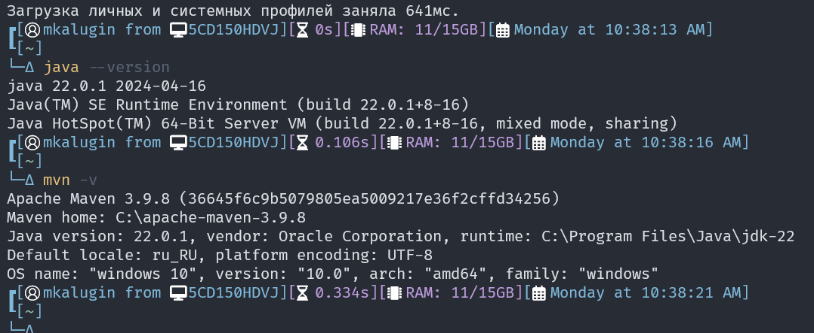
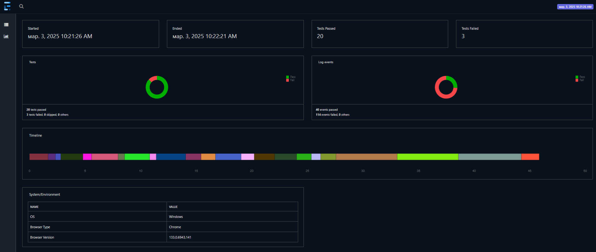
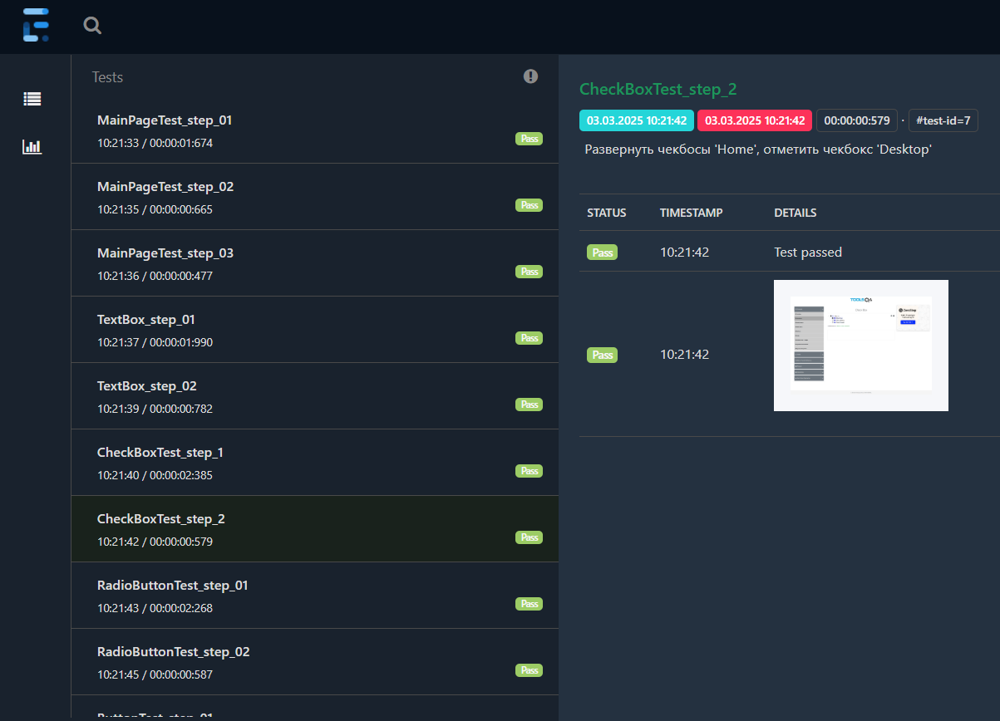
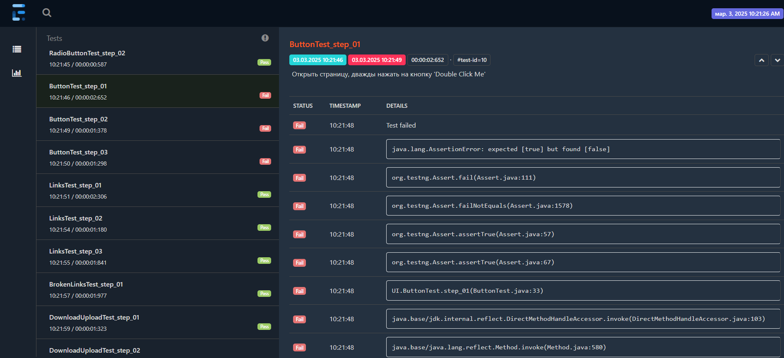
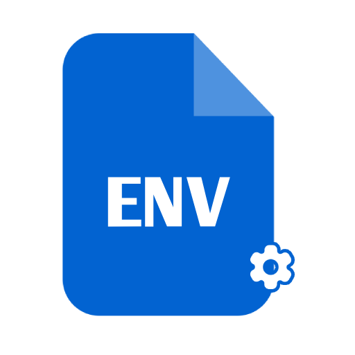

## Проект по результатам стажировки в компании "Лига цифровой экономики" в рамках курса по автоматизации тестирования

- [Описание](#описание)
- [Стэк](#технологии--используемые-в-данном-проекте)
- [Структура проекта](#описание-структуры-проекта)
- [Комментарии по стилю кода](#комментарии-по-стилю-кода)
- [Как скачать проект](#для-скачивания-проекта)
- [Требования для запуска](#для-запуска-проекта-необходимы)
- [Отчеты](#после-выполнения-тестов-будут-доступны-отчеты-img-srcimagesreport_iconpng-altreport-icon-width30-height30-)
- [Полезные ссылки](#полезные-ссылки)
- [Список литературы](#список-литературы)
- [Что можно изучить еще](#что-изучить-еще)
- [Дополнительные материалы](#)
     - [Теория тестирования](descriptions/test_theory.md)
     - [Java](descriptions/java_tutorial.md) 
     - [Maven](descriptions/maven_tutorial.md)
     - [Git](descriptions/git_tutorial.md)
     - [Xpath](descriptions/xpath_tutorial.md)
     - [TestNG](descriptions/testng_tutorial.md)
     - [Selenium](descriptions/selenium_tutorial.md)
     - [Idea](descriptions/idea_tutorial.md)


# Описание:
Этот проект включает базовые технологии и паттерны, необходимые для разработки решения, предназначенного для тестирования веб-сервисов.
В качестве объектов для тестирования были выбраны следующие сервисы:
- `DemoQA` 
- `SauceDemo` 
- `Google` 


# Технологии , используемые в данном проекте:
- Язык программирования  `Java` 22 Версии
- Инструмент для сборки проекта  `Apache Maven`
- Framework для тестирования пользовательских интерфейсов  `Selenium` Версии 4.10
- Библиотека для запуска тестов  `TestNG` Версии 7.8
- Framework для создания отчетов  `ExtentReport` Версии 5.1


# Описание структуры проекта:

```plaintext
├── src
│   ├── main
│   │   ├── java
│   │   │   ├── browser # Классы конфигурации браузера
│   │   │   │   ├── Browser.java # Инициализация и конфигурация браузера
│   │   │   │   ├── Config.java # Дополнительная конфинурация браузера
│   │   │   │   └── Path.java # Пути директорий
│   │   │   ├── constant # Enum файлы для получения значений списка
│   │   │   │   ├── CategoryCards.java # Категории вкладок
│   │   │   │   ├── Item.java # Элементы из списка
│   │   │   │   └── LocatorsType.java # Типы локаторов    
│   │   │   ├── pages  # Классы с описанием страниц
│   │   │   │   ├── base # Базовый класс
│   │   │   │   ├── elements # Классы для страницы с "Элементами"
│   │   │   │   ├── google # Класс для страницы "Google"
│   │   │   │   ├── main # Класс для основной страницы
│   │   │   │   ├── secondPage # Класс для основной страницы со списком категорий
│   │   │   │   ├── sauceDemo # Класс для страницы "SauceDemo"
│   │   │   │   └── widgets # Класс для страницы с "Виджетами"
│   │   │   └── utils # Вспомогательные классы
│   │   │       └── DataGenerator.java # Вспомогательный класс для генерации данных
│   │   └── resources # Ресурсы для проекта (Драйверы)
│   └── test
│       ├── java
│       │   ├── base # Базовый класс теста
│       │   │   └── BaseTest.java # Базовый класс для инициализации и завершения тестов
│       │   ├── UI  # Классы для тестирования UI (интерфейса веб-сервиса)
│       │   └── utils # Вспомогательные классы для тестов
│       │       └── ExtentTestNGListener.java  # Листенер для обработки событий тестов
│       └── resources  # Ресурсы для тестов
│           ├── downloadFiles # Загруженные файлы после тестов        
│           ├── testFiles # Тестовые файлы для загрузки
│           └── testng.xml # Конфигурация TestNG
└──
```


# Комментарии по стилю кода:
- Проект написан в соответствии с паттерном проектирования `PageObject`
- Проект написан в соответстии с практиками и рекомендациями `Code Policy` принятыми в компании для `Java`
- В качестве локаторов использованы переменные типа `String` и `By`
- Описание класса `Browser` представлено одним методом createDriver, не учитывается использование `WebDriverManager`, выбора типа операционной системы.
- Не используется логирование
- Тесты выполняются последовательно в одном потоке , для настройки многопоточности использовать `testng.xml`
- В качестве браузера по умолчанию выбран -  Chrome версии 133.0.6943.141 (актуальной на момент создания проекта). Для запуска возможно потребуется актуализация.
- Также есть возможность запуска тестов в  Firefox (версии 135.0.1) и  Edge (версии 133.0.3065.92) браузерах. Для настройки использовать класс `Config`
- Использованы драйверы для OS -  `Windows`. Для тестирования на  `Linux` требуется скачать соответствующий драйвер.
- Используется CI pipeline для GitHub Actions в качестве примера

# Для скачивания проекта:
1. Нажать на зеленую кнопку "`Code`"
2. Скопировать строчку для выбора скачивания проекта по `HTTPS`
3. В IDE Выбрать "`New Project`" -> "`Project from Version Control`"
4. В "`Url`" вставить скопированное значение
5. Нажать "`Clone`"

# Для запуска проекта необходимы:
- `Java`  22 версии и выше
- `Maven`  версии 3.9.8 и выше
# Также рекомендуется использовать:
- `Git`  версии 2.45 и выше
- `IntellIJ Idea`  версии 2023.3.7 `Community edition` и выше

Проверка в консоли:



Для запуска всех тестов использовать комманду:

```bash
mvn clean test
```

## После выполнения тестов будут доступны отчеты  :

`target/surefire-reports/index.html` - дефолтный отчет

`target/TestsReport.html` - настраиваемый более современный отчет

## Пример отчета:
Общие сведения:



Пример теста , который прошел успешно:



Пример теста , который упал:



# Полезные ссылки:
- https://demoqa.com/ - сайт для тренировки написания UI тестов с различными формами (Используется в проекте)
- https://www.saucedemo.com/ - сайт для тренировки UI тестов в виде магазина (Используется в проекте (пока нет))
- https://testengineer.ru/selenium-webdriver-java-cheat-sheet/ - Примеры использования методов Selenium
- http://85.192.34.140:8081/ - Тренажер для UI тестов (аналог DemoQA)
- https://googlechromelabs.github.io/chrome-for-testing/ - страница для скачивания драйверов для Chrome
- https://geckodriver.org/ - страница для скачивания Geckodriver (Firefox)
- https://mvnrepository.com/ - Репозиторий с зависимостями
- https://maven.apache.org/download.cgi - Загрузка Maven
- https://www.oracle.com/java/technologies/downloads/ - Загрузка jdk
- https://habr.com/ru/companies/intec_balance/articles/884482/ - статья про использование Devtools

# Список литературы:
- Фулстэк тестирование (Гаятри Мохан) главы 1-3
- Selenium Testing Tools Cookbook Second Edition (Unmesh Gundecha)
- ISTQB Certified Tester - Foundation Level Syllabus v4.0

# Что изучить еще:
- [Devtools](https://developer.chrome.com/docs/devtools)  , умение пользоваться консолью в браузере.
- Подход чтения настроек из файлов типа `.env`  и `.properties`
- Запуск тестов с использованием [Proxy](https://www.selenium.dev/documentation/webdriver/drivers/options/) 
- `RestAssured`  - инструмент для тестирования API на java
- `Playwright`  - фрэймворк для тестирования пользовательских интерфесов (альтернатива Selenium)
- `WebDriverManager`  - библиотека для загрузки и инициализации драйвера актуальной версии
- `Allure Report`  - инструмент для генерации отчета по результатам тестов
- `Gradle`  - альтернативный инструмент для сборки проекта
- `JUnit`  - инструмент для запуска тестов. Аналог TestNG.
- `Jenkins`  - инструмент для настройки CI/CD процессов
- `Postman`  - инструмент для тестирования API (HTTP клиент)
- `Apache Kafka`  - распределенный брокер сообщений
- `ELK (Elasticsearch, Kibana, Logstash)`    - сервис для хранения и поиска данных (логов)
- `Charles`  - снифер трафика
- `Docker`  - программа для контейнеризации, развертывания приложений
- `Apache Jmeter`  - инструмент для нагрузочного тестирования
- `Grafana`  - сервис для просмотра метрик


## TODO
1) Актуализировать текущие версии драйверов
2) Исправить `Code Style` , убрать "*" в нижней строчке +/-
3) Добавить несколько тестов с `Widgets` формы
4) Добавить новые методы в `BaseTest` +/-
5) Добавить тесты на `Saucedemo`
6) Обновить `testng.xml` +/-
7) В `CI` файле вынести нестабильные тесты в отдельную группу в `testng.xml`
8) Рефакторинг отчета `ExtentReport`
9) Пофиксить `Google` тест
10) Обновить README.md +/-

**Автор:** Калугин М.С. <a href="https://github.com/MaxainNN" target="_blank"></a>
<a href="mailto:imenolys23@gmail.com"></a>
<a href="https://t.me/maxain" target="_blank"></a>

**Компания:** Лига Цифровой Экономики <a href="https://www.digitalleague.ru/" target="_blank"></a>
<a href="https://t.me/digitalleague" target="_blank"></a>
<a href="https://t.me/digitalleague" target="_blank"></a>

