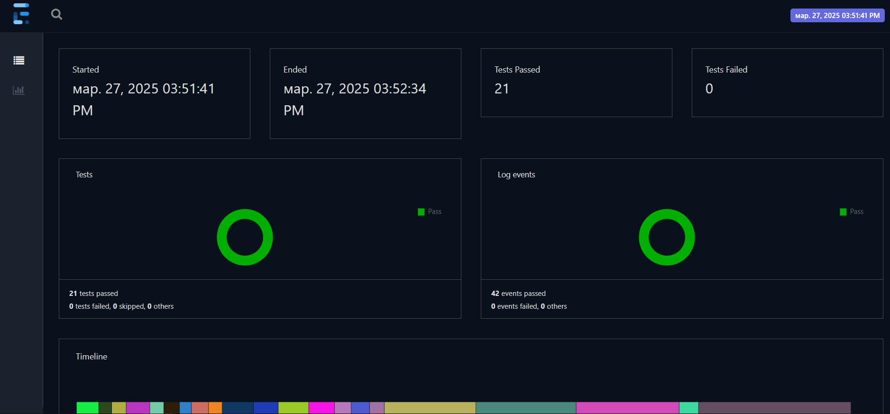
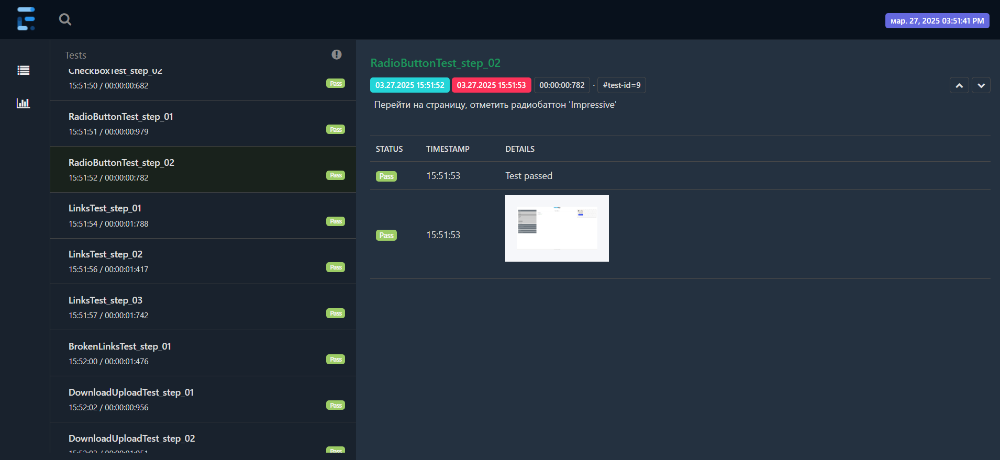
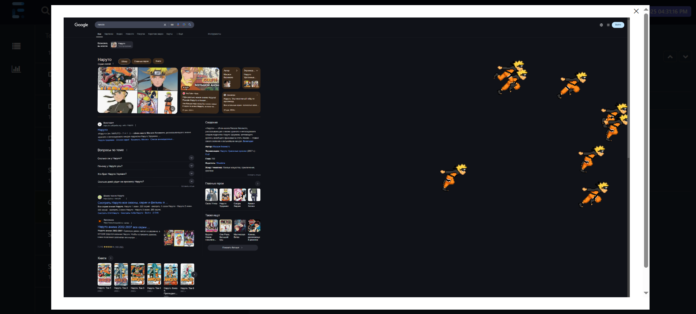
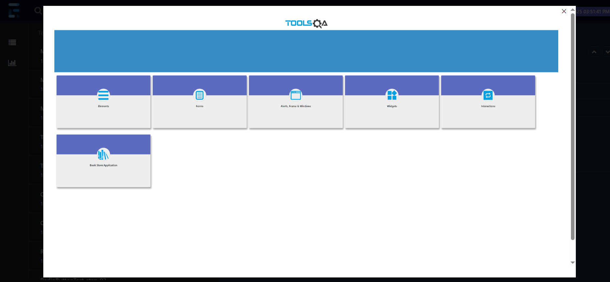
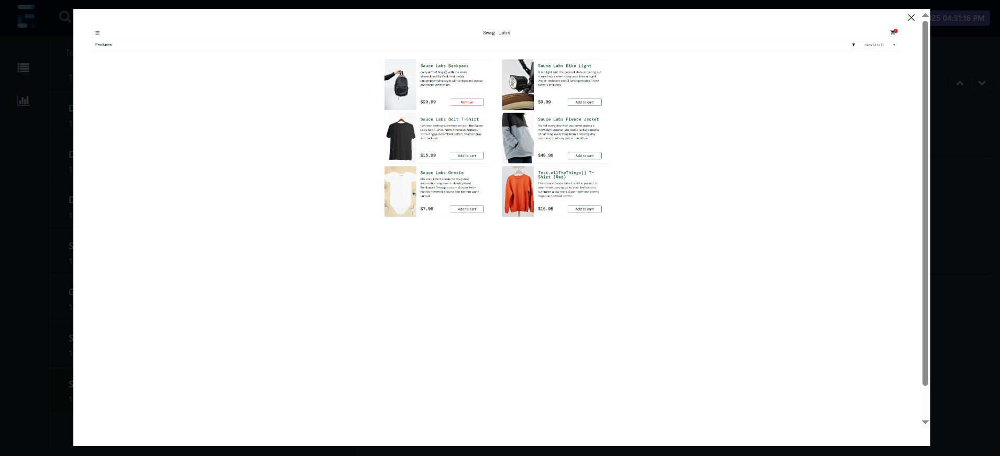

# Проект "Основы тестирования"

- [Описание](#описание)
- [Стэк](#технологии--используемые-в-данном-проекте)
- [Структура проекта](#описание-структуры-проекта)
- [Комментарии по стилю кода](#комментарии-по-стилю-кода)
- [Как скачать проект](#для-скачивания-проекта)
- [Требования для запуска](#для-запуска-проекта-необходимы)
- [Отчеты](#после-выполнения-тестов-будут-доступны-отчеты-)
- [Полезные ссылки](#полезные-ссылки)
- [Список литературы](#список-литературы)
- [Что можно изучить еще](#что-изучить-еще)
- Дополнительные материалы
     - <span style="margin-right: 10px;"></span>[Теория тестирования](descriptions/test_theory.md)
     - <span style="margin-right: 10px;"></span>[Java](descriptions/java_tutorial.md) 
     - <span style="margin-right: 10px;"></span>[Maven](descriptions/maven_tutorial.md)
     - <span style="margin-right: 10px;"></span>[Git](descriptions/git_tutorial.md)
     - <span style="margin-right: 10px;"></span>[Xpath](descriptions/xpath_tutorial.md)
     - <span style="margin-right: 10px;"></span>[TestNG](descriptions/testng_tutorial.md)
     - <span style="margin-right: 10px;"></span>[Selenium](descriptions/selenium_tutorial.md)
     - <span style="margin-right: 10px;"></span>[Idea](descriptions/idea_tutorial.md)


# Описание:
Этот проект включает базовые технологии и паттерны, необходимые для разработки решения, предназначенного для тестирования веб-сервисов.
В качестве объектов для тестирования были выбраны следующие сервисы:
- <span style="margin-right: 5px;">[DemoQA](https://demoqa.com/)</span> 
- <span style="margin-right: 5px;">[SauceDemo](https://www.saucedemo.com/)</span> 
- <span style="margin-right: 5px;">[Google](https://www.google.com/)</span>  


# Технологии , используемые в данном проекте:
- Язык программирования  `Java` 22 Версии
- Инструмент для сборки проекта  `Apache Maven`
- Framework для тестирования пользовательских интерфейсов  `Selenium` Версии 4.10
- Библиотека для запуска тестов  `TestNG` Версии 7.8
- Framework для создания отчетов  `ExtentReport` Версии 5.1


# Описание структуры проекта:

```plaintext
├── src
│   ├── main
│   │   ├── java
│   │   │   ├── browser # Классы конфигурации браузера
│   │   │   │   ├── Browser.java # Инициализация и конфигурация браузера
│   │   │   │   ├── Config.java # Дополнительная конфинурация браузера
│   │   │   │   └── Path.java # Пути директорий
│   │   │   ├── constant # Enum файлы для получения значений списка
│   │   │   │   ├── CategoryCards.java # Категории вкладок
│   │   │   │   ├── Item.java # Элементы из списка
│   │   │   │   └── LocatorsType.java # Типы локаторов    
│   │   │   ├── pages  # Классы с описанием страниц
│   │   │   │   ├── base # Базовый класс страницы
│   │   │   │   ├── demoqa # Классы для страниц DemoQA
│   │   │   │   │   ├── elements # Классы для страницы с "Элементами"
│   │   │   │   │   ├── main # Класс для основной страницы
│   │   │   │   │   ├── secondPage # Классы для основной страницы со списком категорий
│   │   │   │   │   └── widgets # Класс для страницы с "Виджетами"
│   │   │   │   ├── google # Классы для страницы "Google"
│   │   │   │   └── sauceDemo # Классы для страницы "SauceDemo"
│   │   │   └── utils # Вспомогательные классы
│   │   │       └── DataGenerator.java # Вспомогательный класс для генерации данных
│   │   └── resources # Ресурсы для проекта (Драйверы)
│   └── test
│       ├── java
│       │   ├── base # Базовый класс теста
│       │   │   └── BaseTest.java # Базовый класс для инициализации и завершения тестов
│       │   ├── UI  # Классы для тестирования UI (интерфейса веб-сервиса)
│       │   └── utils # Вспомогательные классы для тестов
│       │       ├── ChromeOnlyTransformer.java # Трансформер аннотаций
│       │       └── ExtentTestNGListener.java  # Листенер для обработки событий тестов
│       └── resources  # Ресурсы для тестов
│           ├── downloadFiles # Загруженные файлы после тестов        
│           ├── testFiles # Тестовые файлы для загрузки
│           ├── googleProfile # Кэш с данными профиля Google 
│           └── testng.xml # Конфигурация TestNG
└── run_tests.bat # Скрипт для запуска тестов и просмотра отчета (для Windows)
```


# Комментарии по стилю кода:
- Проект написан в соответствии с паттерном проектирования `Page Object Model`
- Проект написан в соответстии с практиками и рекомендациями `Code Policy` принятыми в компании для `Java`
- Не учитывается использование `WebDriverManager`, выбора типа операционной системы.
- Не используется логирование с помошью библиотек `sl4j` и `log4j2`
- Тесты выполняются последовательно в одном потоке , для настройки многопоточности использовать `testng.xml`
- В качестве браузера по умолчанию выбран -  [Chrome](https://googlechromelabs.github.io/chrome-for-testing/) версии 134.0.6998.90 (актуальной на момент создания проекта). Для запуска возможно потребуется актуализация.
- Также есть возможность запуска тестов в  [Firefox](https://github.com/mozilla/geckodriver/releases) (версии 136.0.2) и  [Edge](https://developer.microsoft.com/en-us/microsoft-edge/tools/webdriver?form=MA13LH) (версии 133.0.3065.92) браузерах. Для настройки использовать класс `Config`
- Использованы драйверы для OS -  `Windows`. Для тестирования на  `Linux` требуется скачать соответствующий драйвер.
- Используется `CI pipeline` для `GitHub Actions` в качестве примера

# Для скачивания проекта:
1. Нажать на зеленую кнопку "`Code`"
2. Скопировать строчку для выбора скачивания проекта по `HTTPS`
3. В IDE Выбрать "`New Project`" -> "`Project from Version Control`"
4. В "`Url`" вставить скопированное значение
5. Нажать "`Clone`"

# Для запуска проекта необходимы:
- `Java`  22 версии и выше
- `Maven`  версии 3.9.8 и выше
# Также рекомендуется использовать:
- `Git`  версии 2.45 и выше
- `IntellIJ Idea`  версии 2023.3.7 `Community edition` и выше

Проверка в консоли:


Для запуска всех тестов использовать комманду:

```bash
mvn clean test
```

## После выполнения тестов будут доступны отчеты :

- `target/surefire-reports/index.html` - дефолтный отчет
- `target/TestsReport.html` - настраиваемый более современный отчет

## Пример отчета:

### Общие сведения:



### Тесты , прошли успешно:



### Скриншот после Google теста:



### Скриншот после DemoQA теста:



### Скриншот после SauceDemo теста:



# Полезные ссылки:
- https://demoqa.com/ - сайт для тренировки написания `UI` тестов с различными формами (Используется в проекте)
- https://www.saucedemo.com/ - сайт для тренировки `UI` тестов в виде магазина (Используется в проекте)
- https://googlechromelabs.github.io/chrome-for-testing/ - страница для скачивания драйверов для Chrome
- https://github.com/mozilla/geckodriver/releases- страница для скачивания `Geckodriver` (Firefox)
- https://developer.microsoft.com/en-us/microsoft-edge/tools/webdriver?form=MA13LH - страница для скачивания `Edge driver`
- https://mvnrepository.com/ - Репозиторий с зависимостями
- https://maven.apache.org/download.cgi - Загрузка `Maven`
- https://www.oracle.com/java/technologies/downloads/ - Загрузка `JDK`

# Список литературы:
- Фулстэк тестирование (Гаятри Мохан) главы 1-3
- Selenium Testing Tools Cookbook Second Edition (Unmesh Gundecha)
- ISTQB Certified Tester - Foundation Level Syllabus v4.0

# Что изучить еще:
- [Devtools](https://developer.chrome.com/docs/devtools)  , умение пользоваться консолью в браузере.
- Подход чтения настроек из файлов типа `.env`  и `.properties`
- Запуск тестов с использованием [Proxy](https://www.selenium.dev/documentation/webdriver/drivers/options/) 
- [RestAssured](https://rest-assured.io/)  - инструмент для тестирования API на java
- [Playwright](https://playwright.dev/)  - фрэймворк для тестирования пользовательских интерфесов (альтернатива Selenium)
- [WebDriverManager](https://github.com/bonigarcia/webdrivermanager)  - библиотека для загрузки и инициализации драйвера актуальной версии
- [Allure Report](https://allurereport.org/)  - инструмент для генерации отчета по результатам тестов
- [Gradle](https://gradle.org/)  - альтернативный инструмент для сборки проекта
- [JUnit 5](https://junit.org/junit5/)  - инструмент для запуска тестов. Аналог TestNG.
- [Jenkins](https://www.jenkins.io/)  - инструмент для настройки CI/CD процессов
- [Postman](https://www.postman.com/)  - инструмент для тестирования API (HTTP клиент)
- [Apache Kafka](https://kafka.apache.org/)  - распределенный брокер сообщений
- [ELK (Elasticsearch, Logstash, Kibana](https://www.elastic.co/elasticsearch)    - сервис для хранения и поиска данных (логов)
- [Charles](https://www.charlesproxy.com/)  - снифер трафика
- [Docker](https://www.docker.com/)  - программа для контейнеризации, развертывания приложений
- [Apache JMeter](https://jmeter.apache.org/)  - инструмент для нагрузочного тестирования
- [Grafana](https://grafana.com/)  - сервис для просмотра метрик

### 

|                                                                                                                                                                                           Автор                                                                                                                                                                                            |                                                                                                                                                                                              Компания                                                                                                                                                                                              |
|:------------------------------------------------------------------------------------------------------------------------------------------------------------------------------------------------------------------------------------------------------------------------------------------------------------------------------------------------------------------------------------------:|:--------------------------------------------------------------------------------------------------------------------------------------------------------------------------------------------------------------------------------------------------------------------------------------------------------------------------------------------------------------------------------------------------:|
|                                                                                                                                                                                        Калугин М.С.                                                                                                                                                                                        |                                                                                                                                                                                      Лига Цифровой Экономики                                                                                                                                                                                       |
| <a href="https://github.com/MaxainNN" target="_blank"></a> <a href="mailto:imenolys23@gmail.com"></a> <a href="https://t.me/maxain" target="_blank"></a>  | <a href="https://www.digitalleague.ru/" target="_blank"></a> <a href="https://t.me/digitalleague" target="_blank"></a> <a href="https://t.me/digitalleague" target="_blank"></a> |


